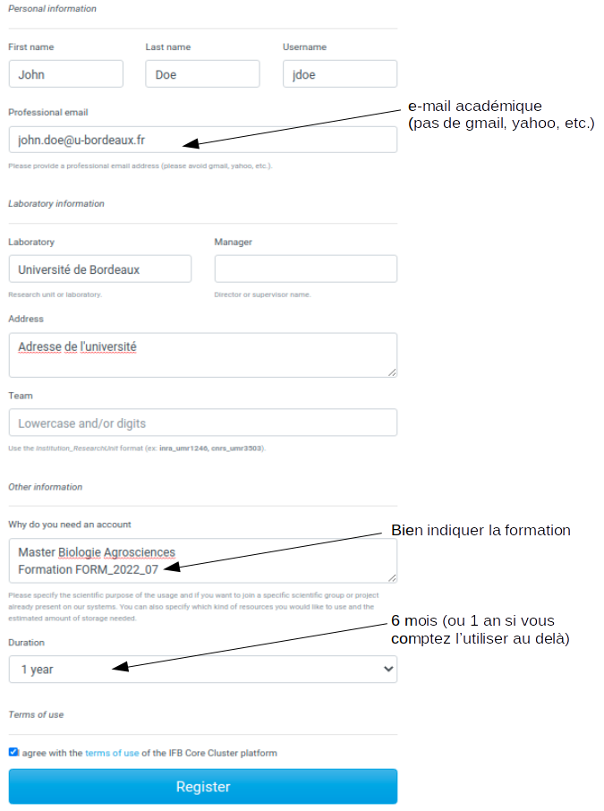

Ce document décrit les étapes pour créer votre compte nominatif sur la plateforme IFB core de l'[Institut Français de Bioinformatique](https://www.france-bioinformatique.fr/).  
Pour cela vous aurez besoin d'une adresse e-mail institutionnelle (pas d'adresse en gmail, hotmail ou autre).  
En fonction des demandes soumises à la plateforme, le traitement de vos demandes peut prendre un peu de temps. Prévoyez donc quelques jours pour aller au bout de la procédure.

# Création de compte

  1. Allez à l’adresse [https://my.cluster.france-bioinformatique.fr/](https://my.cluster.france-bioinformatique.fr/)
  2. Compléter le formulaire comme suit:

  3. Confirmez votre demande d'ouverture de compte en cliquant sur le lien qui vous sera envoyé par e-mail. 
  4. Attendez l'e-mail confirmant la création de votre compte. Il contient votre login et votre mot de passe.
  5. Vous serez également automatiquement abonné à la mailing liste des utilisateurs du core-cluster (core-cluster-users@groupes.france-bioinformatique.fr)
  
A ce stade, il vous est possible de vous connecter à votre compte via SSH (voir document "Comment interagir avec la plateforme IFB core?") mais il est nécessaire de créer ou joindre un projet pour commencer à analyser des données.

# Joindre le projet form_2022_07

Nous utiliserons le projet `form_2022_07` que j'ai déjà créé pour analyser ensemble un premier jeu de données.  
Il vous suffit de me transmettre votre login (= username = user id ; pas votre mot de passe!) pour que je puisse vous ajouter à ce projet.  
Toutes les données du projet sont stockées dans le répertoire `/shared/projects/form_2022_07`  

# Créer un projet pour analyser vos données

Pour analyser vos données, il vous faut créer un projet en vous connectant avec votre login/password sur [https://my.cluster.france-bioinformatique.fr/](https://my.cluster.france-bioinformatique.fr/).  
Si vous travaillez en binôme, un(e) seul(e) d'entre vous peut créer le projet puis il/elle pourra ajouter son/sa camarade via l'interface [https://my.cluster.france-bioinformatique.fr/](https://my.cluster.france-bioinformatique.fr/).  
De la même manière, les données de votre projet seront stockées sous `/shared/projects/<project_name>`  

> **ATTENTION:**  
> Pour des raisons de sécurité, certains accès (IP) peuvent être bloqués si trop de connexions échouent (mauvais mot de passe ou login). Si vous rencontrez des difficultés à accéder au serveur et que vos username/password ne semblent pas fonctionner, ne répétez pas inutilement les tentatives mais contactez moi avant d'être bloqué.

