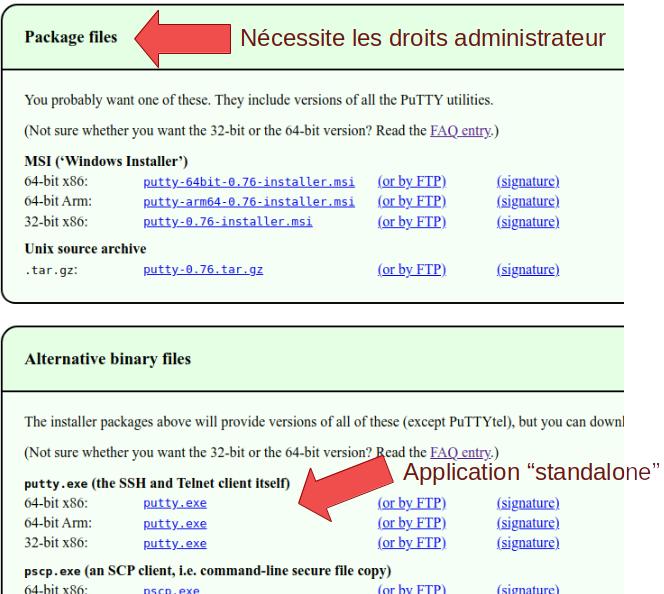
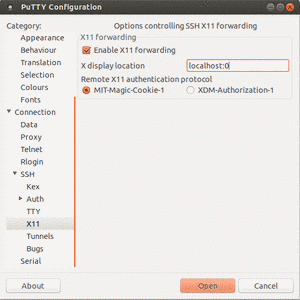
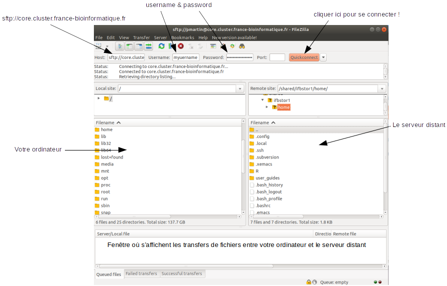
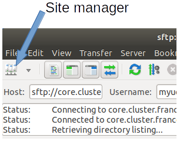

# Introduction

Après avoir obtenu un login auprès de l’IFB core (username + password + un projet ouvert), nous allons voir comment interagir avec la plateforme. En plus de ce document, vous trouverez des informations complémentaires et video explicatives [ici](https://ifb-elixirfr.gitlab.io/cluster/doc/quick-start/) et [là](https://ifb-elixirfr.gitlab.io/cluster/doc/logging-in/).   
La plateforme [bioinfo Genotoul](http://bioinfo.genotoul.fr/) fournit également des [pages d'aide](http://bioinfo.genotoul.fr/index.php/faq/user_access_faq/) très utiles.  
Le schéma ci-dessous résume ce que nous voulons faire dans un premier temps: nous connecter à un serveur frontal (ou “noeud de login”), par lequel nous devons passer pour utiliser le cluster de calcul.


# Client SSH: échanger des commandes

Pour échanger des commandes et du texte avec le serveur frontal, nous utilisons le protocole SSH ([Secure SHell](https://fr.wikipedia.org/wiki/Secure_Shell)). Il nous faut donc un client SSH pour nous connecter au serveur frontal.  

Pour se connecter au serveur frontal, nous utiliserons la commande
```bash
ssh <username>@core.cluster.france-bioinformatique.fr
```
qui sera suivie de l'entrée du mot de passe.

### Linux et MacOS
Sous Linux/Mac, il suffit d'ouvrir un terminal et d'y entrer la commande ci-dessus.  

### Windows
Sous windows, il faut installer le logiciel [Putty](https://www.putty.org/) que vous pouvez télécharger [ici](https://www.chiark.greenend.org.uk/~sgtatham/putty/latest.html). Si vous avez un ordinateur relativement récent, c'est sans doute la version `64-bit x86` qu'il vous faut. En cas de doute, consultez l'[aide](https://www.chiark.greenend.org.uk/~sgtatham/putty/faq.html#faq-32bit-64bit).  
Notez que vous n'avez pas besoin de télécharger l'installeur (`*.msi`) qui nécessitera des droits administrateur pour s'installer. Il vous suffit de télécharger la version "standalone" du client SSH et Telnet:



Putty va nous permettre d'échanger du texte (i.e. des commandes ou des sorties texte) avec le serveur frontal.  

Après avoir installé Putty:

**Configuration:**  

  - ouvrez-le en double-cliquant sur l'executable
  - Sous `Session -> Host Name` entrer `core.cluster.france-bioinformatique.fr`  
  - Sous `Session -> Connection type` sélectionner `SSH`  
  - FACULTATIF: Si vous avez également installé Xming (voir ci-dessous), vous pouvez configurer le forwarding X11 en cochant `Enable X11 forwarding` et en entrant `localhost:0` sous `X display location`. Enfin, sélectionner `MIT-Magic-Cookie-1`
  
  - Retour dans le menu `Session`, dans la partie basse de la fenêtre entrer un nom (par exemple `IFBcore`) pour sauvegarder la configuration puis cliquer sur `Save`  
  
  
**Connexion:**  

  - Une fois la configuration effectuée, cliquer sur `Open` pour lancer une session.  
  - Accepter l'enregistrement de l'empreinte du serveur.  
  - Enfin, entrer username et password pour se connecter au serveur frontal.
 

# Visualiser des images

Lorsque l'on génère des figures ou images, il faut en général:  

  1. Les sauvegarder dans un fichier sur le serveur (ex: jpg, png, tiff...)
  2. Les télécharger sur votre poste (voir ci-dessous)
  3. Les visualiser sur votre poste
  
  
Il est néanmoins possible de visualiser directement des figures générées à la volée sur le serveur en activant ce que l'on appelle le [déport d'affichage avec SSH](https://www.it-connect.fr/chapitres/deport-daffichage-avec-ssh-x11-forwarding/) ("X11 forwarding"" en anglais).  
Sous Unix ou MacOS, il suffit de se connecter au serveur via SSH en utilisant l'option `-X`:

```bash
ssh -X <username>@core.cluster.france-bioinformatique.fr
```

Sous Windows, il faut aussi installer un serveur X comme [Xming](https://sourceforge.net/projects/xming/). Des instructions complémentaires peuvent être trouvées [ici](http://bioinfo.genotoul.fr/index.php/faq/user_access_faq/). Cette fonction n'étant pas indispensable, nous n'en couvrons pas les détails ici.


# Echanger des fichiers: `scp` et `sftp`

  En plus d'échanger des commandes avec le serveur, nous allons avoir besoin d'échanger des fichiers avec celui-ci, que ce soit de déposer des fichiers de notre ordinateur vers le serveur ou bien de récupérer des fichiers générés par exemple sur le cluster.  

### Commande `scp`
  Il est possible de faire cela en ligne de commande grâce à la commande [`scp`](https://www.commandlinux.com/man-page/man1/scp.1.html) qui s'utilise comme suit:  
```bash
scp <source> <destination>
```
La `source` pouvant être un ou des fichiers (par exemple en utilisant des patterns [glob](https://en.wikipedia.org/wiki/Glob_\(programming\))) et la destination typiquement un répertoire (ou un nom de fichier si on souhaite aussi modifier le nom du fichier de destination).  

De manière plus détaillée (mais tout n'est pas obligatoire) la commande peut ressembler à ça:  

```bash
scp user@source_host:source_path/source_file user@destination_host:destination_path/destination_file
```

Par exemple, si je veux copier tous les fichiers `.txt` du répertoire dans lequel je me trouve vers le répertoire `/home/<myusername>/myproject` (remplacer `<myusername>` par votre username), j'utiliserai la commande suivante:
```bash
scp *.txt <myusername>@core.cluster.france-bioinformatique.fr:/home/<myusername>/myproject
```


### `sftp` en ligne de commande
  Les protocoles `FTP` ([File Transfer Protocol](https://fr.wikipedia.org/wiki/File_Transfer_Protocol)) et `SFTP` ([SSH File Transfer Protocol](https://fr.wikipedia.org/wiki/SSH_File_Transfer_Protocol))servent précisément à échanger des fichiers à travers un réseau.  
  Il est possible d'utiliser ces protocoles en ligne de commande. Voir par exemple ces tutoriels pour le [`FTP`](https://www.computerhope.com/issues/ch001246.htm) ou le  [`SFTP`](https://www.digitalocean.com/community/tutorials/how-to-use-sftp-to-securely-transfer-files-with-a-remote-server-fr)


### `sftp` via un client dédié

  La solution la plus simple consiste à utiliser un logiciel pour échanger des fichiers par simple glisser-déposer.  
  On peut notamment citer:  
  
  - [FileZilla](https://filezilla-project.org/)
  - [WinSCP](https://winscp.net/eng/download.php)
  
  Nous allons voir comment configurer Filezilla.  
  
  Après avoir installé Filezilla, il est possible de se connecter en remplissant simplement la ligne du haut comme ceci:  
  
  
  On peut également sauvegarder cette configuration pour un accès ultérieur plus facile en enregistrant ces paramètres dans le `Site Manager` auquel on accède en cliquant ici:
  
  
  Une fois la connexion établlie, les fichiers peuvent être transférés par simple glisser-déposer.  
  


