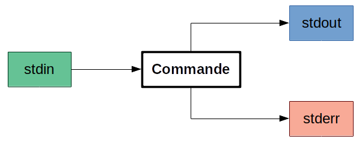
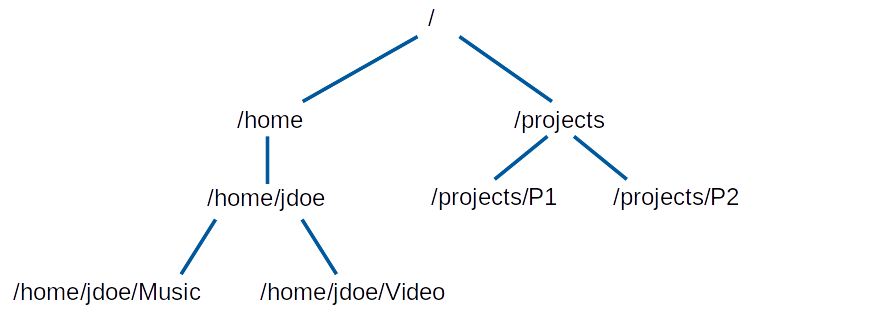
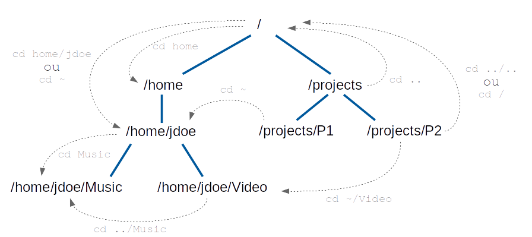
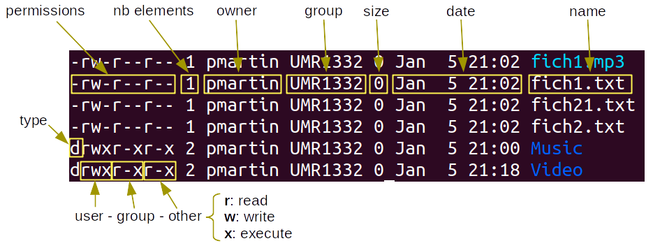

Sans devenir forcément expert(e), connaître quelques commandes de bases devient vite indispensable pour interagir avec une plateforme de bioinformatique.  

Il existe de nombreuses ressources pour se former à unix/linux.  
En voici quelques unes (liste loin d'être exhaustive):  

  - Page Wikipedia sur l'[interface en ligne de commande](https://fr.wikipedia.org/wiki/Interface_en_ligne_de_commande)  
  - Document de formation à UNIX sur la plateforme [bioinfo genotoul](http://genoweb.toulouse.inra.fr/~formation/unix/doc/Formation_LINUX_GenoToul.pdf)  
  - Une bonne introduction video en français aux [commandes unix de bases](https://www.youtube.com/watch?v=4jlPZtc17l8)  
  - Une liste détaillée des [principales commandes](https://doc.ubuntu-fr.org/tutoriel/console_commandes_de_base)
  - Un cours très complet d'[introduction à Linux](https://aful.org/ressources/formations/formation-introduction-linux/downloadFile/file/IntroductionLinux.pdf) qui va au delà des commandes des commandes de base
  - Un guide d'[outils avancés](https://tldp.org/LDP/abs/html/index.html) pour l'écriture de scripts en bash (en anglais et une traduction en [français](https://abs.traduc.org/abs-5.0-fr/index.html))   


Ce qui nous permet de communiquer avec le système d'exploitation est appelé l'interface système ou le [shell](https://fr.wikipedia.org/wiki/Interface_syst%C3%A8me). C'est une interface en ligne de commande à laquelle on accède via un terminal / une console. Dans les sytèmes [Unix](https://fr.wikipedia.org/wiki/Shell_Unix), il existe plusieurs interpréteurs de commandes dont les syntaxes diffèrent légèrement. Nous utiliserons l'interpréteur le plus courant : [Bash](https://fr.wikipedia.org/wiki/Bourne-Again_shell)  

<br>

# Syntaxe et aide sur les commandes

## Syntaxe

La syntaxe générale d'une commande prend la forme:

```bash
commande [-options] [paramètres]
```

*ce qui est entre crochet `[]` est facultatif*

où:  

  - **commande** = ce que l'on veut faire  
  - **options** = comment le faire
  - **paramètres** = sur quoi on le fait


Quelques exemples:

  - `mkdir -p mydir`: créer un répertoire (vide) appelé `mydir` sans renvoyer une erreur si le répertoire existe (option `-p`)  
  - `cd mydir` : aller dans le répertoire `mydir`
  - `touch mytest.txt`: créer un fichier (vide) appelé `mytest.txt`
  - `ls -l` : affiche le contenu du répertoire courant, au format "long" (`-l`)
  - `ls -1` : affiche le contenu du répertoire courant, avec un élément par ligne (`-1`)
  - `tree` : même chose mais sous un format plus sympathique. Ici aucune option ou paramètre

<br>
Les longues commandes peuvent être séparées sur plusieurs lignes en plaçant un backspace `\` à la fin de chaque ligne (attention: `\` doit être le dernier caractère de la ligne, ne pas mettre d'espace après!):  
Ainsi:  `cp -R mydir mydircopy` peut s'écrire:  

```bash
cp \
  -R \
  mydir \
  mydircopy
```

Par sécurité on peut également terminer une commande par un point-virgule `;`:

```bash
cp \
  -R \
  mydir \
  mydircopy \
;
```

<br>
Pour certaines options, on dispose d'**abbréviations** : La version "longue" est précédée d'un double tiret `--` alors que la version courte est précédée d'un tiret unique `-`.  
Ainsi `ls --all` (l'option affiche tous les fichiers, y compris les fichiers "cachés" qui sont, sous unix, précédés par un point `.`) est parfaitement équivalent à `ls -a`  

<br>

> Le caractère `#` est utilisé pour précéder un commentaire, c'est à dire un texte qui n'est pas interprété comme une commande.
> ```bash
> # Une ligne de commentaire
> ls -l # Un commentaire en fin de ligne 
> ```

## Aide sur les commandes

La commande `man` permet d'obtenir le manuel d'une commande:  
```bash
man pwd
```
On peut également simplement taper `pwd command manual` sur son moteur de recherche pour trouver une [page d'aide](https://man7.org/linux/man-pages/man1/pwd.1.html) plus facile à lire.

Certaines commandes possèdent également une option `--help`, souvent raccourcie en `-h` (ainsi qu'une option `--version`):  

```bash
cat --help
cat --version
```

<br>

## flux standards et redirection
L'execution d'une commande peut impliquer 3 [flux standards](http://manpages.ubuntu.com/manpages/bionic/fr/man3/stdin.3.html), i.e. 3 flux d'échange de données (= de texte):



  - `stdin` est le flux d'entrée  
  - `stdout` est le flux de sortie  
  - `stderr` est le flux des messages d'erreur

Les flux `stdout` et `stderr` s'affichent par défaut dans le terminal mais il est possible de les rediriger.  
Pa exemple, la commande `ls` liste les fichiers ou dossiers présents dans un répertoire et renvoie cette liste dans `stdout`, c'est à dire affiche la liste des dossiers à l'écran.  
Mais on peut rediriger cette sortie vers une autre fonction en utilisant `|` (ALTGR + 6) appelé un **pipe** (prononciation [\\pajp\\](https://upload.wikimedia.org/wikipedia/commons/transcoded/4/4e/LL-Q150_%28fra%29-LoquaxFR-pipe.wav/LL-Q150_%28fra%29-LoquaxFR-pipe.wav.mp3)): 

```bash
ls | cat
```   


On peut également rediriger la sortie vers un fichier avec `>` : 

```bash
ls > monfichier.txt
```

Si le fichier `monfichier.txt` existe déjà, il sera écrasé.  
Pour ajouter le résultat de la commande `ls` à la fin du fichier `monfichier.txt` existant :  

```bash
ls >> monfichier.txt
```  

Tous les flux d'entré/sortie peuvent être redirigés, voire fusionnés, selon une  [syntaxe](https://fr.wikipedia.org/wiki/Interface_en_ligne_de_commande#Les_redirections_d'entr%C3%A9es/sorties) qui dépasse le cadre de ce document.

<br>
<br>

# Arborescence et navigation

## Arborescence

  - `/` est le répertoire racine (un peu comme `C:` sous Windows)  
  - Sous unix, votre répertoire "home" est typiquement `/home/<username>` mais sur l'IFB core ce sera `/shared/home/<username>`. Dans tous les cas, le symbole `~` correspond à votre répertoire "home"  
  - `.` est le répertoire courant (celui où l'on se trouve)
  - `..` est le répertoire parent (celui situé un cran au dessus dans l'arborescence)

Voici un exemple simple d'arborescence unix:  


La commande `cd` ("change directory") sert à se déplacer d'un répertoire à l'autre. Dans l'arborescence ci-dessus, on pourrait par exemple utiliser:  


La commande `pwd` renvoie le chemin du répertoire courant.  
Quand on utilise la commande `cd`, on peut utiliser un **chemin absolu** ou bien un **chemin relatif** (i.e. relatif au dossier courant).  
Par exemple, si je suis dans le répertoire `/projects/P1` et que je veux me rendre dans le répertoire `/home/jdoe`, je peux écrire:

  - `cd /home/jdoe` (chemin absolu)  
  ou bien
  - `cd ../../home/jdoe` (chemin relatif, sans grand intérêt ici...)  


## Naviguer dans les répertoires

  - `pwd` : pour savoir où on est
  - `cd <chemin_du_répertoire>` : pour changer de répertoire 
  - `ls` : pour lister les fichiers et répertoires

la commande `ls` a de nombreuses options et peut prendre un chemin particulier en paramètre.   
Quelques exemples:  

```bash
# simple listing du répertoire courant
ls
# listing d'un répertoire particulier
ls /home/jdoe
# un seul fichier par ligne
ls -1
# sortie longue
ls -l
# sortie longue et fichier cachés
ls -l -a
# que l'on peut aussi écrire
ls -la
# même chose en formatant la taille des fichier de manière plus sympathique
ls -lah
```

**Créer/effacer des répertoires**:  

  - `mkdir -p <chemin_du_répertoire>` pour créer un répertoire. L'option `-p` est recommandée
  - `rmdir <chemin_du_répertoire>` pour effacer un répertoire (à condition qu'il soit vide)
  - `rm -R <chemin_du_répertoire>` pour effacer un répertoire et tout ce qu'il contient (l'option `-R`, qui peut aussi s'écrire `-r` ou `--recursive`, applique la fonction `rm` de manière récursive sur tous les fichiers et sous-dossiers du répertoire).  
  
**Attention** à votre utilisation de la commande `rm`... elle efface...
  

<br>
<br>


# Manipuler des fichiers

## création de fichiers

On a vu comment créer:  

  - un fichier vide avec `touch`  
  - un fichier via la redirection de la sortie standard `stdout` d'une commande à l'aide du symbole `>` ou `>>` ("append"").  

On peut également directement ajouter du texte dans un fichier avec :  

```bash
echo "mon texte à ajouter" >> monfichier.txt
printf "%s\n" "mon autre texte à ajouter" >> monfichier.txt
```

La fonction [`printf`](https://fr.wikipedia.org/wiki/Printf) sert à formatter son argument, ici une chaine de caractère que l'on représente dans le format par **`%s`** et à laquelle on ajoute un retour à la ligne avec **`\n`**.  
Autre exemple avec 2 chaines de caractères séparées par une tabulation (`\t`):  

```bash
printf "%s\t%s" "texte1" "texte2" >> monfichier.txt
```

`printf` est une fonction très riche pour laquelle vous trouverez de nombreuses pages d'[aide et d'exemples](https://wiki.bash-hackers.org/commands/builtin/printf).  

<br>

Ajouter le contenu d'un fichier à la fin d'un autre fichier :  
```bash
cat monfichier.txt >> monNouveauFichier.txt
```

<br>

## Copie, déplacement et suppression

Ces commandes peuvent s'utiliser sur des fichiers ou des dossiers:

  - la commande `cp` pour copier des fichiers (`scp` pour copier via `ssh`):

```bash
cp <mon_fichier> <mon_répertoire_destination>
cp <mon_fichier> <mon_nouveau_fichier>
cp -r <mon_répertoire_source> <mon_répertoire_destination>
```

  - la commande `mv` pour déplacer un fichier. Notez que renommer un fichier est une forme de déplacement. On utilisera donc: `mv <mon_fichier> <mon_nouveau_fichier>`, que le nouveau fichier soit placé ou non dans le même répertoire.

  - la commande `rm` pour effacer. A utiliser avec précaution.

<br>

## Afficher / modifier le contenu d'un fichier

Pour examiner le contenu d'un fichier texte, on utilisera typiquement:  

  - `cat` renvoie le contenu du fichier dans la sortie standard `stdout` (attention si le fichier est très long....)  
  - `head` et `tail` pour afficher les premières et dernières lignes d'un fichier
  - `more` et `less` pour afficher progressivement le contenu d'un fichier

Pour en modifier le contenu, on pourra utiliser des éditeurs de texte en ligne de commande comme [`nano`](https://www.nano-editor.org/) (plus facile) , ou bien [`vim` / `vi`](https://www.vim.org/) (plus compliqué). Ces éditeurs sont relativement peu intuitifs à utiliser mais l'aide en ligne est riche. Si on y a accès, on préfèrera au début un éditeur avec une interface graphique comme [`gedit`](https://doc.ubuntu-fr.org/gedit).

Pour modifier un texte dans un flux (par exemple en enchainant des commandes), on utilisera généralement [`sed`](https://www.gnu.org/software/sed/manual/sed.html) ou [`awk`](https://fr.wikipedia.org/wiki/Awk). Là aussi, leur utilisation nécessite un apprentissage spécifique.

<br>
<br>

# Gestion des droits

A chaque fichier/dossier dans unix sont associés des droits en terme de:

  - **lecture** (**`r`** pour *read*)  
  - d'**écriture** (**`w`** pour *write*)   
  - d'**exécution** (**`x`** comme dans *execute*)  


Ces droits sont appliqués à 3 niveaux: 

  - l'**utilisateur** (**`u`** pour *user*)
  - le **groupe d'utilisateurs** (**`g`** pour *group*)
  - les **autres utilisateurs** (**`o`** pour *other*)  

Pour assigner les droits, on utilisera aussi l'abbréviation **`a`** pour *all* qui représente **tous les utilisateurs**  

Dans un répertoire test, créons des fichiers et un dossier puis listons le contenu du répertoire au format long (`ls -l`) :

```bash
mkdir -p tmpdir
cd tmpdir
touch fich1.txt fich1.mp3 fich2.txt fich21.txt
mkdir -p Music Video
ls -l
```

En fonction des réglages par défaut du serveur sur lequel vous travaillez vous n'aurez peut-être pas exactement les mêmes résultats.  



<br>

Pour régler les permissions, nous utilisons la commande [`chmod`](https://man7.org/linux/man-pages/man1/chmod.1p.html) (pour _**ch**ange **mod**e_).  
Référez-vous à la [page Wikipedia](https://fr.wikipedia.org/wiki/Chmod) qui explique très clairement l'utilisation de `chmod`.  

Quelques exemples (observez les résultats avec `ls -l`) :

```bash
# Ajouter les droits d'écriture au groupe :
chmod g+w fich1.txt
# Enlever les droits de lecture aux autres utilisateurs :
chmod o-r fich1.txt
# Ajouter les droits d'écriture de manière récursive dans un dossier à tous les utilisateurs:
chmod -R a+w Music
# Utilisation des codes en octal pour régler tous les droits (ici rwxr-xr--)
chmod 754 fich2.txt
```

<br>
<br>

# Wildcards / glob
Des caractères spéciaux ou ["wildcards"](https://en.wikipedia.org/wiki/Glob_(programming)) peuvent être utilisés pour spécifier des patterns qui représentent des ensembles de fichiers/dossiers.  

Commençons par créer quelques fichiers:  

```bash
touch fich1.txt fich1.mp3 fich2.txt fich3.txt fich4.txt fich21.txt 
```

  - **`?`** remplace un unique caractère
  ```bash
  ls -1 fich?.txt
  ```
  
  - **`*`** remplace 0, 1 ou plusieurs caractères
  ```bash
  ls -1 fich*.txt
  ls -1 *.txt
  ls -1 fich1.*
  ```

  - **`[]`** remplace un caractère dans une sélection
  ```bash
  ls -1 fich[1-3].txt # n'inclue pas fich21.txt
  ls -1 fich[124]*.txt # n'inclue pas fich3.txt
  ls -1 fich[!4]*.txt # n'inclue pas fich4.txt
  ```


<br>
<br>

# Autres commandes utiles

  - [`grep`](https://fr.wikipedia.org/wiki/Grep) pour rechercher des chaînes de caractères
  - [`find`](https://fr.wikipedia.org/wiki/Find) pour trouver des fichiers/dossiers
  - [`ln -s <source_file> <myfile>`](https://kb.iu.edu/d/abbe) pour créer des liens symboliques (équivalent des "raccourcis" sous Windows)
  - [`wget`](https://fr.wikipedia.org/wiki/GNU_Wget) et [`curl`](https://fr.wikipedia.org/wiki/CURL) pour télécharger des fichiers depuis internet
  - [`gzip` / `gunzip`](https://fr.wikipedia.org/wiki/Gzip) et [`tar`]() pour compresser/décompresser des fichiers
  
  ```bash
  # archiver le dossier Music en compressant les fichier avec gzip
  tar -cvzf music.tar.gz Music/
  # Décompresser l'archive
  tar -xvzf music.tar.gz /tmp
  ```

  - [`sort`](https://fr.wikipedia.org/wiki/Sort_(Unix)) pour trier des lignes de fichier
  
  ```bash
  # trier fichier1.txt par les valeurs (numériques -n) ascendantes présentes dans la 2ème colonne du fichier
  sort -k2 -n fichier1.txt
  ```
  
  - [`cut`](https://fr.wikipedia.org/wiki/Cut_(Unix)) pour récupérer des colonnes dans un fichier (mais `awk` est souvent plus adapté pour cela)
  - [`uniq`](https://fr.wikipedia.org/wiki/Uniq) pour supprimer les doublons
  
  ```bash
  # Trier les lignes de myfile selon le nombre de fois où elles apparaissent
  sort myfile | uniq -c | sort -n
  ```
  
  - [`du`](https://fr.wikipedia.org/wiki/Du_(Unix)) pour vérifier l'espace disque utilisé.
  
  ```bash
  # Taille globale occupée par le répertoire home (~)
  du -sbh ~
  ```
  
  - [`wc`](https://en.wikipedia.org/wiki/Wc_(Unix)) pour compter des caractères, des bytes ou des lignes dans un fichier.  
  
  ```bash
  # Nombre de lignes dans fich1.txt
  wc -l fich1.txt 
  ```
  

<br>

# VARIABLES

> Paragraphe concernant une utilisation plus avancée  

Quelques documents utiles concernant les variables:

  - Une excellente introduction aux [variables d'environnement Unix](https://chamilo.grenoble-inp.fr/courses/ENSIMAG3MMUNIX/document/avance/seance2-varenv-pas-pas/tp-pas-pas-varenv.pdf)
  - Documentation Ubuntu sur les [variables d'environnement](https://doc.ubuntu-fr.org/variables_d_environnement)  
  - La [manipulation de texte](https://tldp.org/LDP/abs/html/string-manipulation.html) sous Unix
  

## Variables d'environnement  

### Définition  
Dans unix/linux, l'environnement est composé de *variables* qui décrivent comment il fonctionne (exemple: la langue, le fuseau horaire, la localisation du dossier home, le nom de l'ordinateur, le nom de l'utilisateur, etc.).  
On appelle ces variables des **variables d'environnement**.  
Pour accéder aux variables qui composent votre environnement, utilisez la commande `env`.  
Pour accéder à la valeur prise par une variable précise, on la précède du signe `$`.  
Par exemple, la variable `LANG` indique la langue utilisée: `echo $LANG` ou bien `echo "$LANG"`   


### Portée et héritabilité  
Lorsque vous ouvrez un terminal, vous lançez un processus `bash` auquel seront automatiquement affectées des valeurs par défaut d'un certain nombre de variables d'environnement (cf `env`).  
Si vous changez les valeurs de certaines variables ou que vous créez de nouvelles variables (voir plus bas) à l'intérieur d'un terminal/processus, cette modification gardera une portée locale, c'est à dire qu'il en sera tenu uniquement à l'intérieur de ce terminal/processus.  
Quand on souhaite qu'une variable soit héritée d'un processus parent à un processus enfant, il faut *exporter* la variable.  

Un exemple qui fonctionnera sous Ubuntu (dans lequel la commande `gnome-terminal` lance un nouveau terminal):  
```bash
# ouvrez un terminal (Terminal 1) et crez la variable
MYNAME="John DOE"
# lancez un autre terminal (Terminal 2) en tapant dans Terminal 1 la commande:
gnome-terminal
# Terminal 2 est un processus enfant de Terminal 1 
# La variable MYNAME n'a aucune valeur dans Terminal 2 car elle n'a pas été exportée dans Terminal 1:
echo $MYNAME
# Fermer le Terminal 2
# Dans Terminal 1 taper:
export MYNAME
# Puis (ouverture d'un nouveau processus: Terminal 3)
gnome-terminal
#A présent, dans Terminal 3, la variable MYNAME existe:
echo $MYNAME
```

Une variable peut également être définie/modifiée et exportée uniquement par un programme particulier (et ses descendants). Pour cela on fait la modification de la variable dans la même commande dans laquelle on lance le programme.  
Par exemple:  

```bash
echo $TZ #affiche le fuseau horaire
date # programme qui donne la date et l'heure
TZ='Europe/London' date #On change la variable TZ puis on affiche la date
echo $TZ #la variable d'environnement TZ n'a pas été modifiée
```

Enfin, le fichier `~/.bashrc` est lu à chaque démarrage d'un terminal et peut contenir ou modifier des variables.

### Exemple: la variable PATH  
La variable `PATH` contient la liste des répertoires dans lesquels le système cherche un programme à exécuter. Les répertoires sont séparés par le signe `:`.  
Ainsi, si la variable `PATH` contient `/usr/bin:/usr/sbin:/usr/local/bin`, et qu'on écrit dans un terminal `echo "Bonjour"`, le système recherchera le programme `echo` dans l'un des 3 répertoires:

  - `/usr/bin`  
  - `/usr/sbin`  
  - `/usr/local/bin`  
  
Si il ne le trouve pas, il renverra une erreur.  

La commande `which` renvoie le chemin où se trouve un programme.  
Par exemple : `which echo` renvoie `/usr/bin/echo`.  
Unix a trouvé la commande (=le programme) `echo` car elle se trouve dans l'un des dossiers de la variable d'environnement `PATH`.  
On peut le vérifier en tappant : `echo $PATH` ou bien `echo "$PATH"` et on constate qu'il y a bien écrit quelque part `/usr/bin`, encadré par des `:`.  

Si, lors d'une session de travail, je sais que je vais utiliser plusieurs programmes qui se trouvent dans le dossier `~/Softwares`, je peux ajouter ce chemin à la variable `PATH`:  

```bash
PATH="$PATH":~/Softwares
#ou bien
PATH=~/Softwares:"$PATH"
#puis
export PATH
```

ou bien directement:
```bash
export PATH="$PATH":~/Softwares
```

### Quelques autres variables d'environnement

  - `HOME` contient le chemin du répertoire home. Voir `echo $HOME`
  - `USER` contient le nom d'utilisateur. Parfois aussi `USERNAME` et `LOGNAME`.

```bash
echo "Mon username est $USER"
```

  - `PWD` contient le répertoire courant

```bash
cd ~
echo $PWD
cd ~/Documents
echo $PWD
```

  - `TMPDIR` contient (parfois) le chemin du répertoire temporaire. Par défaut les répertoires `/tmp` et `/var/tmp` sont utilisés  
  
  - `$RANDOM` est en fait une fonction interne de Bash qui renvoie un nombre entier [pseudo-aléatoire](https://abs.traduc.org/abs-fr/ch09s03.html) dans l'intervalle 0-32767    
  - `SHELL` contient l'interpréteur par défaut. Voir `echo $SHELL`  
  - `PS1` définit l'allure du prompt. Voici des [exemples](https://linux-attitude.fr/post/modifier-son-prompt)  
  

### Création et utilisation de variables  

Une variable n'est autre qu'un étiquette affectée à un contenu.

> Pour **définir** une variable on écrit simplement son nom, sans `$`, et suivi de `=` (**sans espaces**)  
> Pour **supprimer** une variable on utilise la commande `unset`  
> Pour **utiliser** le contenu d'une variable, on précède son nom du signe `$`  
> Pour **modifier** le contenu d'une variable, on précède son nom du signe `$` et on l'encadre par de accolades `{}`  


Exemples:  

```bash
MYNAME="John"
echo "My name is $MYNAME"
echo "My name is MYNAME"
#on remplace "hn" par "sh" :
MYNAME=${MYNAME/hn/sh}
echo "My name is $MYNAME"
unset MYNAME
echo "My name is $MYNAME"
```

**Guillemets ou apostrophes ?**  
Lorsqu'on référence une variable, il est conseillé de placer son nom entre des **guillemets** (doubles) `" "`. Ainsi les caractères spéciaux à l'intérieur de la chaîne de caractères ne seront pas interprétés, mis à part les caractères `$`, ``\`` (caractère d'échappement) et `` ` `` (apostrophe inversée). Comme le signe `$` est toujours interprété (sauf s'il est précédé du signe `\`), la variable sera remplacée par son contenu.  
En revanche, encadrer une chaîne de caractères par des **apostrophes** ou guillemet simple: `' '` empêche l'interprétation ou l'expansion par le shell:  

```bash
MYNAME="John"
echo My name is "$MYNAME"
echo My name is '$MYNAME'
```

**valeur par défaut d'une variable**  
Dans un script, il est également possible d'affecter une valeur par défaut à une variable. La variable ne prendra ainsi la valeur par défaut que si la variable est vide:  

```bash
#La variable est vide:
unset MYNAME
#On peut également utiliser:
MYNAME=""
# On lui donne la valeur par défaut "John"
MYNAME=${MYNAME:-John}
# Donc elle prend la valeur "John"
echo "My name is $MYNAME"

# La variable contient quelque chose:
MYNAME="Sam"
# On lui donne la valeur par défaut "John"
MYNAME=${MYNAME:-John}
# Elle garde la valeur qu'elle avait
echo "My name is $MYNAME"
```


### Modification de variables / manipulation de texte  

Il existe de multiples façons de modifier une chaine de charactères contenue dans une variable. On se réfèrera notamment à ce [guide](https://tldp.org/LDP/abs/html/string-manipulation.html) très pratique.  

Pour illustrer quelques outils de manipulation de texte, nous allons partir d'une variable contenant le chemin (fictif) vers un fichier. Les fonctions `basename` et `dirname` sont utiles pour manipuler les chemins:  

```bash
MYFILEPATH="/shared/projects/myfolder/mydata/Sample1_R1_L001.fastq.gz"
#longueur de la chaine de charactères
echo ${#MYFILEPATH}

#le dossier dans lequel se trouve le fichier:
dirname "$MYFILEPATH"
#le nom du fichier:
basename "$MYFILEPATH"

# créer une nouvelle variable contenant uniquement le nom du fichier:
MYFILE=$(basename "$MYFILEPATH")
echo "$MYFILE"
```


Extraire une partie de la chaine de caractère

```bash
#Extraire 2 caractères à partir de la 9ème lettre:
echo "${MYFILE:8:2}"
#la numérotation commence à 0
echo "${MYFILE:0:3}"
```

Supprimer la fin d'une chaine de caractère:  

```bash
#pour supprimer l'extension ".gz" du nom de fichier:
echo "${MYFILEPATH%%.gz}"
#par exemple pour décompresser le fichier sans supprimer le fichier compressé de départ:
gunzip -c "$MYFILEPATH" > "${MYFILEPATH%%.gz}"
```

On peut utiliser des caractères spéciaux pour définir la chaine de caractère à éliminer. Ainsi on utilisera `%` (une seule fois) pour éliminer le match le plus court et `%%` (2 fois) pour le match le plus long.

```bash
echo "${MYFILEPATH%.*gz}"
echo "${MYFILEPATH%%.*gz}"
```

Supprimer le début d'une chaîne de caractères:

```bash
# Supprimer "Sample"
echo ${MYFILE#Sample}
# Supprimer le match le plus court
echo ${MYFILE#S*1}
# ou le match le plus long
echo ${MYFILE##S*1}
```

Remplacer une partie d'une chaine de caractère:  

```bash
echo ${MYFILE/Sample1/Sample2}
echo ${MYFILE/_R1_/_R2_}
```


### Variable Array

Une **variable array** est un type de variable particulier qui peut contenir plusieurs valeurs.  
En bash on peut créer un array ainsi:  

```bash
MyArray=("Sam" "John" "Josh" "Will")
```

Les index des valeurs dans l'array commence par l'index 0.  
On peut extraire des valeurs individuelles de l'array avec:
```bash
echo "${MyArray[0]}"
echo "${MyArray[1]}"
echo "${MyArray[2]}"
echo "${MyArray[3]}"
echo "${MyArray[4]}" #empty
```

Ajouter une valeur dans l'array (ou remplacer une valeur existante):
```bash
MyArray[4]="Dave"
```

Pour renvoyer toutes les valeurs en même temps:  
```bash
echo "${MyArray[@]}"
# ou bien
echo "${MyArray[*]}"
```

Nombre d'éléments contenu dans un array:
```bash
echo ${#MyArray[@]}
#ou bien 
echo ${#MyArray[*]}
```

Indices des éléments de l'array:
```bash
echo ${!MyArray[@]}
#ou bien 
echo ${!MyArray[*]}
```

Une boucle utilisant les valeurs d'un array:  
```bash
for myname in "${MyArray[@]}"
do
  echo My name is "$myname"
done
```

Une boucle utilisant les indices d'un array:
```bash
for i in ${!MyArray[@]} 
  do 
    echo My name is "${MyArray[$i]}" 
  done

# ou bien

for ((i = 0; i < ${#MyArray[@]}; i++)) 
  do 
    echo My name is "${MyArray[$i]}" 
  done
```
