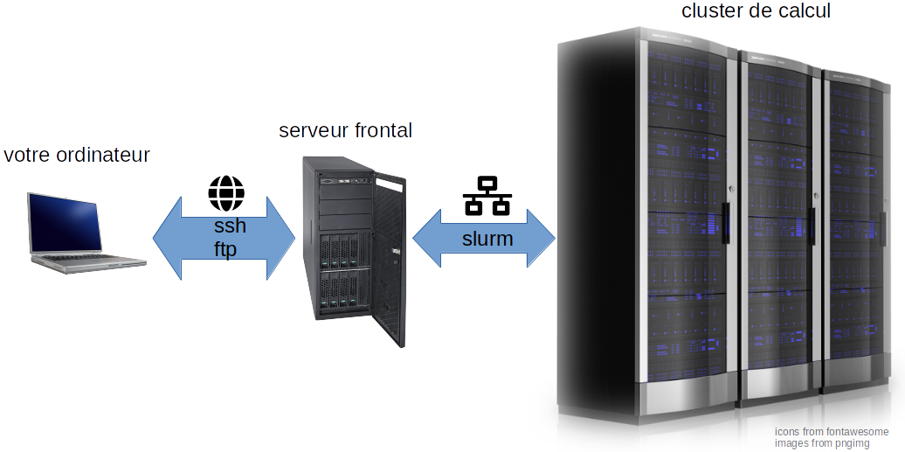

# Introduction

[SLURM](https://slurm.schedmd.com) est un gestionnaire de fil  ou *scheduler* en anglais. Une fois connecté au serveur frontal via `ssh` c'est via **SLURM** que nous pourrons lancer des "**jobs**", sous forme de scripts, sur le cluster de calcul.   
**SLURM** va gérer pour nous la file d'attente (i.e. quand notre job sera lancé compte tenu des autres jobs en attente et des ressources disponibles) et quelles sont les ressources qui lui seront allouées (typiquement temps, CPU, mémoire).  



Une [fiche résumée](https://slurm.schedmd.com/pdfs/summary.pdf) des commandes slurm et une [documentation complète](https://slurm.schedmd.com/man_index.html) des différentes commandes sont disponible en ligne.  
**SLURM** nous permettra également de nous connecter directement à un noeud du cluster pour y lancer des commandes de manière **interactive**, c'est à dire qu'on pourra écrire et lancer une commande et qu'elle s'exécutera immédiatement.  

<br>

# Connexion interactive  

Puisque tous les utilisateurs d'une plateforme de bioinformatique se connectent à un même serveur frontal, il est important que celui-ci ne soit pas utilisé pour lancer des calculs ou des opérations utilisant beaucoup de ressources. Sinon c'est l'embouteillage.  
Pourtant il est parfois utile de tester rapidement une commande ou de réaliser une opération lourde sur des fichiers sans forcément écrire un script dédié à cette opération.  
C'est typiquement dans ce cas qu'on souhaitera se connecter à un noeud du cluster de calcul pour pouvoir y lancer des commandes de manière interactive. Cette connexion peut se faire de la manière suivante:  

```bash
srun --pty bash
```  
Sur certains serveurs il est possible d'utiliser le [X11 forwarding](https://fr.wikipedia.org/wiki/X_Window_System) avec :  

```bash
srun --x11 --pty bash
```

Il existe de [nombreuses options](https://slurm.schedmd.com/srun.html) pour demander des ressources précises en termes de coeurs/processeurs ou [CPU](https://fr.wikipedia.org/wiki/Processeur) (la partie qui effectue les calculs) et en termes de [mémoire](https://fr.wikipedia.org/wiki/M%C3%A9moire_(informatique)) (ce qui permet de stocker des données). Certains calculs (moins fréquents) peuvent également faire appel à des processeurs graphiques ou [GPU](https://fr.wikipedia.org/wiki/Processeur_graphique).  
Les options les plus courantes sont présentées dans le paragraphe suivant et peuvent être utiliser de la même manière pour soumettre un job via un script (commande `sbatch`) ou via une session interactive (commande `srun`).  
Par exemple, la commande ci-dessous demande l'ouverture d'une session interactive de 2 heures avec 2 CPU et 16G de mémoire:  

```bash
srun --time=02:00:00 --cpus-per-task=2 --mem=16G --pty bash
```

Quand on a terminé notre travail dans une session interactive, on la quitte en entrant:  

```bash
exit
```

ou bien en utilisant le raccourci `CTRL + D`  


<br>


# Soumettre un script  

## Préparer un script  

Un script est un fichier texte qui contient les commandes que l'on souhaite exécuter.  
Les scripts que nous allons utiliser doivent toujours commencer par `#!/bin/bash` que l'on appelle le [Shebang](https://fr.wikipedia.org/wiki/Shebang) et qui précise au système le language qui est utilisé dans le script. Ici on utilisera donc [bash](https://fr.wikipedia.org/wiki/Bourne-Again_shell).  

Le fichier texte ci-dessous est un script qui renvoie le texte `Hello World`.

```bash
#!/bin/bash
echo 'Hello World'
```

On peut créer ce fichier, que l'on nomme `HelloWorld.sh` en ligne de commande de la manière suivante:

```bash
printf "%s\n" '#!/bin/bash' > HelloWorld.sh
printf "%s\n" "echo 'Hello World'" >> HelloWorld.sh
```

Si on vérifie la création du fichier `HelloWorld.sh` à l'aide de la commande `ls -l`, on constate qu'on ne possède pas les droits pour exécuter ce fichier.  
Les droits sont `-rw-rw-r--`, autrement dit tout le monde peut lire le fichier (`r`), l'utilisateur et les membres du groupes peuvent écrire (`w`) dans le fichier mais personne ne peut l'exécuter (`x`).  
Le script n'est donc pas utilisable pour l'instant.  
Pour cela, on donne à l'utilisateur les droits d'exécution avec:

```bash
chmod u+x HelloWorld.sh
```

On vérifie avec la commande `ls -l` que l'on dispose bien des droits d'exécution à présent: `-rwxrw-r--`  

Comme notre script ne consomme quasiment aucune resource, on peut le lancer directement en tapant:

```bash
./HelloWorld.sh
```


## Soumettre le script avec `sbatch`  

## `sbatch` et les sorties

La commande [`sbatch`](https://slurm.schedmd.com/sbatch.html) est la commande qui permet de soumettre un script au cluster de calcul.  
On peut donc soumettre notre script en écrivant:  

```bash
sbatch HelloWorld.sh
```

Un identifiant `<job_id>`, sous la forme d'une série de chiffre, a été assigné à notre job.  
Une fois le job terminé, un nouveau fichier est apparu dans notre répertoire de travail: `slurm-<job_id>.out`.  
Ce fichier contient ce qu'a renvoyé notre job: `cat slurm-<job_id>.out`  

En général, il est utile de choisir où ces données sont renvoyées. On peut le faire ainsi:

```bash
sbatch --output="script_output_%j.out" HelloWorld.sh
```

`%j` sera automatiquement remplacé par le `<job_id>`. Pour les jobs arrays (voir ci-dessous), on utilisera plutôt `%A_%a` où `%A` sera remplacé par le `<job_id>`et `%a` sera remplacé par l'`<array_index>`.  

Dans certains cas, nos scripts renverront (malheureusement) des erreurs. Par défaut celles-ci seront renvoyées dans le même fichier `slurm-<job_id>.out` que précédemment. Il est utile de séparer les erreurs et les sorties d'un script dans deux fichiers distincts via:  

```bash
sbatch \
  --output="script_output_%j.out" \
  --error="script_error_%j.err" \
  HelloWorld.sh
```

*Notez l'utilisation du signe `\` en fin de ligne pour séparer une même commande sur plusieurs lignes. Ce signe doit être le dernier caractère de la ligne (donc pas d'expace après!)*


## Gestion des ressources et options courantes

Les options les plus couramment utilisées avec `sbatch` sont:

  - `-A` ou bien `--account=<account>`.  
  Nous utiliserons cette option sur la plateforme de l'[IFB](https://www.france-bioinformatique.fr/) pour spécifier qu'un job doit être affecté à un projet spécifique.  
  
```bash
#un job assigné au projet form_2022_07
sbatch --account=form_2022_07 HelloWorld.sh
```

  - `-t` ou bien `--time=<time>` pour péciser le temps maximum assigné à un job. Les formats possibles sont:  
      - "minutes"  
      - "minutes:secondes"  
      - "heures:minutes:secondes"  
      - "jours-heures"  
      - "jours-heures:minutes"  
      - "jours-heures:minutes:secondes"  

```bash
#Un job de 10 secondes en utilisant le format jours-heures:minutes:secondes
sbatch --time="0-0:0:10" HelloWorld.sh
```

  - `-J` ou bien `--job-name=<jobname>`. Le nom du job (différent du `<job_id>`)   

```bash
#Un job appelé HelloWorld
sbatch --job-name="HelloWorld" HelloWorld.sh
```

  - `--mem=<size>[units]` ou bien `--mem-per-cpu=<size>[units]` pour assigner une quantité de mémoire au job. L'unité `[units]` par défaut est le megabyte mais il est possible d'utiliser les suffixes `K` (kilo), `M` (mega), `G` (giga) et `T` (tera).   

```bash
#Un job utilisant 100K de mémoire:
sbatch --mem=100K HelloWorld.sh
```

  - `-p` ou bien `--partition=<partition_names>`. Sur certains systèmes, il existe plusieurs partitions, c'est à dire des regroupements de noeuds de calculs possédant leurs propres quotas en terme de durée maximum, nombre de coeurs, mémoire, etc. La commande `sinfo` permet de voir quelles partitions existent sur le système. Il existe une partition par défaut dont le nom est suivie du signe `*`.

```bash
#Un job lancé sur la partition fast 
sbatch --partition=fast HelloWorld.sh
# "fast"" étant la partition par défaut sur l'IFBcore, cela revient à :
sbatch HelloWorld.sh
```


  - `--mail-type=<type>` pour contrôler quand un e-mail doit être envoyé à l'utilisateur. Les valeurs possibles de `<type>` sont `NONE`, `BEGIN`, `END`, `FAIL`, `REQUEUE`, `ALL` et peuvent être combinées en les séparant par une virgule.  
  - `--mail-user=<user>` l'adresse à laquelle envoyer les e-mails (par défaut l'adresse fournie par l'utilisateur lors de son inscription)

```bash
#Un job qui m'envoie plein d'emails
sbatch \
  --mail-type==BEGIN,FAIL,END \
  --mail-user=mon.adresse@email.com \
  HelloWorld.sh
```

  - `--wrap="<command>"` permet de lancer directement une commande, sans l'empaqueter dans un script

```bash
#Un job simple soumis sans script
sbatch --wrap "echo Hello World"
# Cette option est pratique pour lancer par exemple un script R avec:
sbatch --wrap "Rscript monScript.R"
```

<br>

Dans certains cas, un programme peut utiliser plusieurs processeurs (calcul parallèle), voire un script peut lancer plusieurs tâches/programmes qui peuvent également être lancés en parallèle. Les options ci-dessous sont utilisées dans ces cas pour réserver les ressources nécessaires à ce type de job :  

  - `-c` ou bien `--cpus-per-task=<ncpus>`. Nombre de processeurs par tâche. Un processus qui a 4 tâches et requiert `--cpus-per-task=6`, recevra ainsi 6 processeurs issus d'un même noeud pour chaque tâche, soit 6 processeurs x 4 noeuds = 24 processeurs au total.
  - `-N` ou bien `--nodes=<minnodes>` pour spécifier le nombre minimum de noeuds affectés à un job.
  - `-n` ou bien `--ntasks=<number>`  pour spécifier le nombre de tâches lancées en parallèle par le script.

D'autres explications sur la soumission de jobs parallèles sont disponibles [ici](https://kb.iu.edu/d/awrz).   
Nous nous contenterons en général d'utiliser des scripts qui ne lancent qu'une seule tâche ou bien des tâches successives et non parallèles. Mais certains programmes pourront utiliser plusieurs processeurs, nous utiliserons donc essentiellement l'option `--cpus-per-task=<ncpus>`.  


```bash
#Un job demandant 2 processeur (mais n'en utilisant qu'un en pratique...):
sbatch --cpus-per-task=2 HelloWorld.sh
```


Toutes ces options peuvent bien sûr être combinées, rendant parfois les commandes `sbatch` assez touffues:  

```bash
sbatch \
  --time=00:00:30  \
  --job-name="Hello_World" \
  --output="output_%j.out" \
  --error="error_%j.err" \
  --mem=100K \
  --cpus-per-task=2 \
  --mail-type=BEGIN,END,FAIL \
  HelloWorld.sh
```

<br>

## Incorporer les options directement dans le script      

De fait, parmi les nombreuses options qui existent pour la commande `sbatch` on en utilise en général un nombre relativement limité et souvent les mêmes.  
Afin d'alléger au maximum les commandes `sbatch` et de garder une traçabilité sur les ressources allouées à chaque job, il est possible d'incorporer les options de la commandes `sbatch` directement dans le script qui contient nos commandes en plaçant ces options en début de script (après le shebang) et en les faisant précéder par `#SBATCH `.  

Un exemple de script :

```bash
# !/bin/bash
#SBATCH --time=00:00:30  #30s job time limit
#SBATCH -J Hello_World #job name
#SBATCH --output=output_%j.out #output file name
#SBATCH --error=error_%j.err #error file name
#SBATCH --mem=100K #memory reservation
#SBATCH --cpus-per-task=2 #ncpu on the same node
#SBATCH --mail-type=BEGIN,END,FAIL 

echo "Hello World!"
```

Si le script se nomme `MonHello.sh`, il sera simplement lancé avec `sbatch MonHello.sh` et toutes les options indiquées dans le scripts seront utilisées par **SLURM**.

<br>

## Utilisation des variables d'environnement

> Paragraphe concernant une utilisation avancée

A l'intérieur d'un script, il est possible d'utiliser des [variables d'environnement](https://fr.wikipedia.org/wiki/Variable_d%27environnement) définies dans l'environnement depuis lequel on lance le job (pour nous : le serveur frontal) en les propageant à l'environnement dans lequel le script est exécuté (pour nous, sur le cluster de calcul).  
Ainsi, la variable `USER` contient notre `<username>` sur la plateforme : voir `echo "$USER"`  

On peut créer un simple script qui renvoie `Hello <username>` comme suit:  

```bash
printf "%s\n" '#!/bin/bash' > HelloUser.sh
printf "%s\n" 'echo "Hello $USER"' >> HelloUser.sh
```

et le lancer avec: `sbatch HelloUser.sh` qui est équivalent à `sbatch --export=ALL HelloUser.sh` (`ALL` étant la valeur par défaut).  

Par contre, si on créé une nouvelle variable, par exemple `MONNOM="John DOE"` et qu'on modifie le script pour qu'il utilise cette nouvelle variable:  

```bash
printf "%s\n" '#!/bin/bash' > HelloUser.sh
printf "%s\n" 'echo "Hello $MONNOM"' >> HelloUser.sh
```

dans ce cas les différentes commandes `./HelloUser.sh` ou bien `sbatch HelloUser.sh` ou encore `sbatch --export=ALL HelloUser.sh` ne renvoient pas ce que l'on souhaite.  
Pour que le script "hérite" de cette variable, soit il faut exporter la variable, soit on peut écrire:  

```bash
MONNOM="John DOE" ./HelloUser.sh`  
```

Et avec sbatch :

```bash
sbatch --export=MONNOM="John DOE" HelloUser.sh
```

Un autre exemple avec 2 variables :  

```bash
#Création du script:
printf "%s\n" '#!/bin/bash' > HelloUser.sh
printf "%s\n" 'echo "Hello $PRENOM $NOM"' >> HelloUser.sh

#lancement du script
sbatch --export=PRENOM="John",NOM="DOE" HelloUser.sh
```


Lorsqu'un job est lancé, [slurm](https://slurm.schedmd.com/) créé un certain nombre de variables qui commencent toutes par `SLURM_` et que nous pouvons utiliser dans nos scripts. Il n'est pas nécessaire des les exporter explicitement avec `--export=` car elles sont toujours exportées. 

Quelques variables qui peuvent être utiles:  

  - `SLURM_JOB_ID` contient le `<job_id>` qui a été assigné à notre job.  
  - `SLURM_CPUS_PER_TASK` contient le nombre de CPU alloué à chaque tâche et réglé à l'aide de l'option `--cpus-per-task=`  
  - `SLURM_ARRAY_TASK_ID` contient l'index ou ID du job array (voir ci-dessous)  


<br>

## Les jobs arrays    

> Paragraphe concernant une utilisation avancée

En utilisant un unique script, il est possible de lancer plusieurs jobs via un **job array**.  Le job initial porte un identifiant ou `<job_id>` et les sous-jobs portent un indice ou `<array_index>`.  

Pour cela, on utilisera avec `sbatch` l'option:  

  - `-a` ou bien `--array=<indices>`.  
  Les `<indices>` peuvent être indiqué via une liste de valeurs séparées par des virgules ou bien via un intervale de valeurs. Par exemple: `--array=0-3` est équivalent à `--array=0,1,2,3`.  
  On peut également combiner ces deux manières de spécifier les indices: `--array=1,3,5-8`.  
  Il est également possible de spécifier un pas entre les valeurs d'un intervalle. Ainsi `--array=0-15:4` est équivalent à `--array=0,4,8,12`.  
  On peut également spécifier un nombre maximum de tâches issues du job array qui peuvent tourner en même temps. Ainsi `--array=0-15%4` ne lancera au maximum que 4 jobs à la fois.

Souvent, on utilisera les **job array** avec des **variables arrays** unix.  

Exemple:
```bash
#!/bin/bash
#SBATCH --time=00:00:30
#SBATCH --output=HelloWho_%A_%a.out
#SBATCH --error=HelloWho_%A_%a.out
#SBATCH --mem=100K
#SBATCH --array=0-3

#Un array de noms:
NAMES=("Sam" "John" "Josh" "Will")

#On utilise la variable SLURM qui renvoie l'indice de l'array afin de récupérer le nom correspondant
echo Hello "${NAMES[$SLURM_ARRAY_TASK_ID]}"
```

Si on place ce script dans un fichier texte nommé `HelloWho.sh` auquel on donne les droits d'exécution, on peut lancer ce script avec `sbatch HelloWho.sh`  
Chaque fichier de sortie correspondra à un nom de l'array `NAMES`  

<br>


# Suivi des jobs et des ressources

Ces fonctions permettent de consulter les ressources disponibles, de suivre l'exécution d'un job ou d'annuler un job.  

### Vérifier les resources disponibles

  - [`sinfo`](https://slurm.schedmd.com/sinfo.html) pour des infos sur les différentes partitions.

```bash
#info détaillées sur la partition bigmem
sinfo --long --partition="bigmem"
```

  - [`scontrol`](https://slurm.schedmd.com/scontrol.html) pour des infos détaillées (et un contrôle pour les administrateurs du système) sur les noeuds, les partitions, les jobs ou la configuration.

```bash
#info détaillées sur un job précis
scontrol show job="1051270"
# infos détaillées sur la partition bigmem
scontrol show partition="bigmem"
#info détaillées sur la configuration
scontrol show config
```

  - [`sacct`](https://slurm.schedmd.com/sacct.html) pour des infos sur votre compte et les jobs qui y sont associés. En particulier, cette fonction peut fournir des infos sur les ressources utilisées par les jobs (voir aussi ce [post](https://stackoverflow.com/questions/24020420/find-out-the-cpu-time-and-memory-usage-of-a-slurm-job)).

```bash
#combien mon job a utilié de temps CPU et de mémoire?
sacct --format="JobID,JobName,CPUTime,MaxRSS"  --jobs="20811551"
```


### Suivre son job ou l'annuler

> [`squeue`](https://slurm.schedmd.com/squeue.html) et [`scancel`](https://slurm.schedmd.com/scancel.html) sont sans doute les commandes que vous utiliserez le plus


  - [`squeue`](https://slurm.schedmd.com/squeue.html) pour voir tous les jobs actuellement soumis sur le système.  
  Pour suivre vos propres jobs et non ceux de tous les utilisateurs, vous utiliserez :

```bash
# Mes jobs soumis:
squeue -u <username>
```

  Le champ `ST` indique le status du job. Le plus souvent il prend la valeur `PD` pour *pending* (= en attente) ou bien `R` pour *running*.  
  Le champ `NODELIST(REASON)` indique sur quel noeud le job a été lancé ou bien la raison pour laquelle le job est en attente.


  - [`scancel`](https://slurm.schedmd.com/scancel.html) pour annuler un job, qu'il soit en attente ou en cours d'exécution.

```bash
# Annuler le job 1051307
scancel 1051307
# s'il s'agit d'un job array tous les jobs 1051307_* seront arrêtés
# pour en arrêter un seul (ici: 1051307_2):
scancel 1051307_2
```


  - [`sstat`](https://slurm.schedmd.com/sstat.html) fourni des infos détaillés sur un job en cours d'exécution. Cette commande est à utiliser avec parcimonie car elle peut consommer des ressources.

```bash
# détail de mon jobs (soumis avec sbatch) en cours d'exécution:
# "1051307.batch" est "l'étape" du job "1051307" où sont collectées les données car le job a été soumis avec sbatch et non avec srun
sstat --jobs="1051307.batch" 
# juste une partie des infos
sstat --format="JobID,AveRSS,AveCPU" --jobs="1051307.batch"
```

<br>
