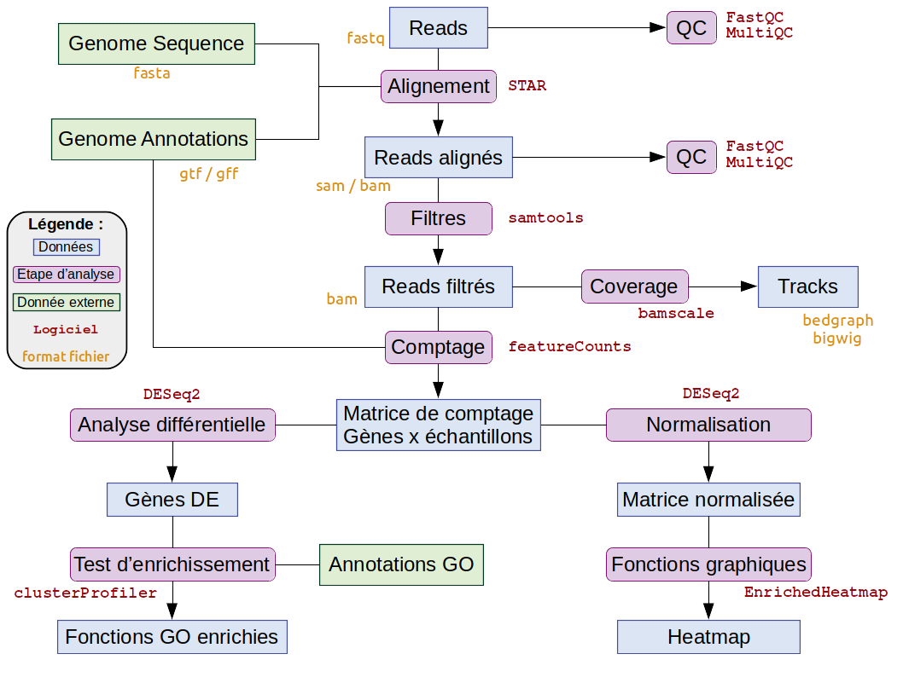
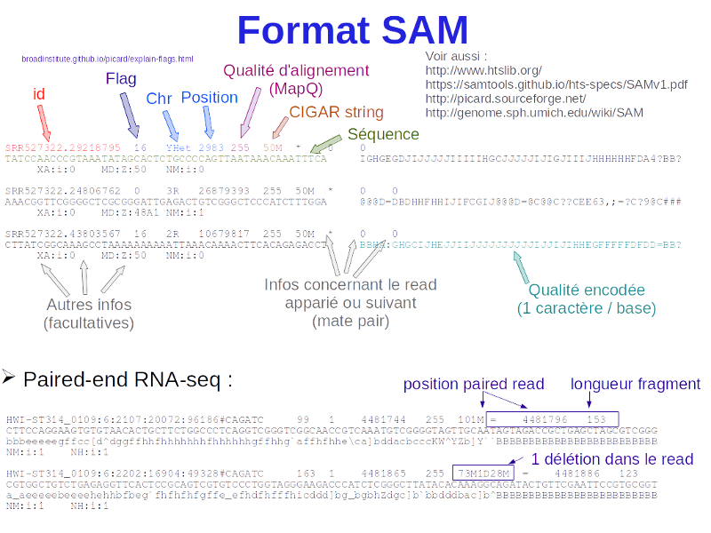
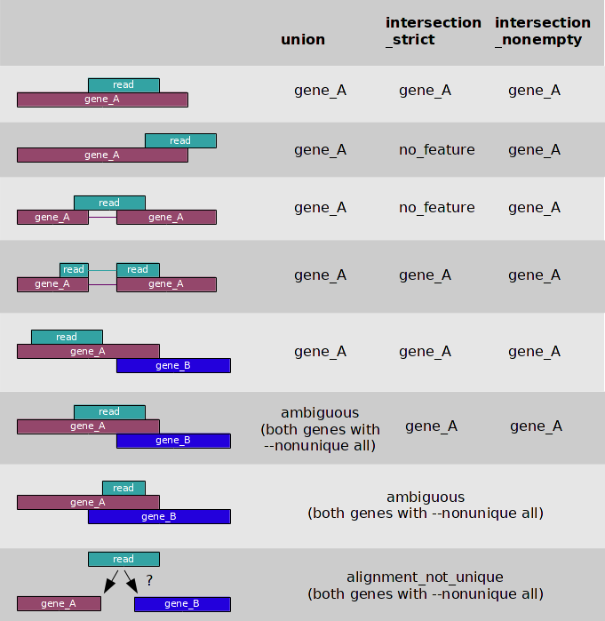
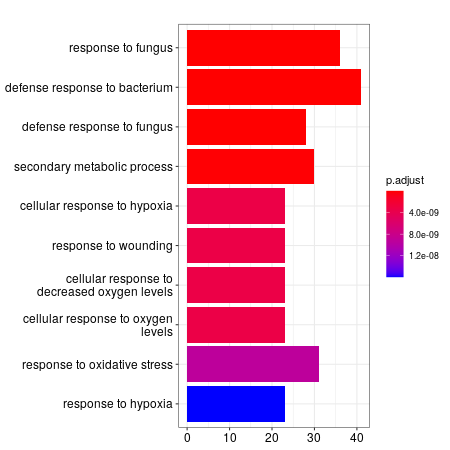
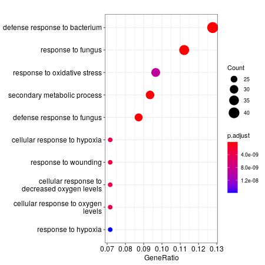
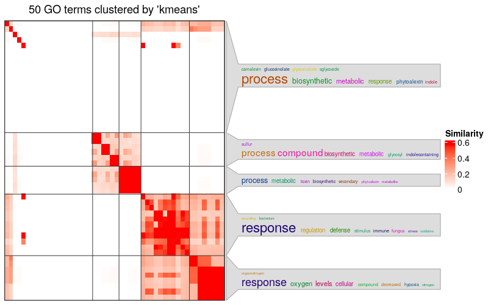
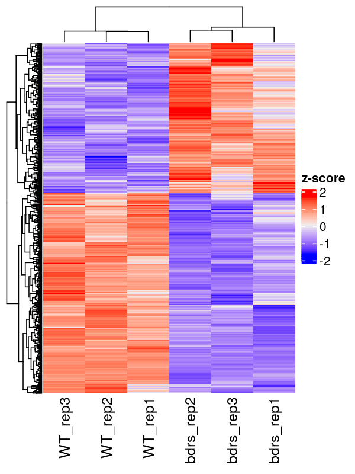

<!-- convert to md using 
      rmarkdown::render("05_RNAseq_analysis_GSE112441.Rmd", 
                        rmarkdown::md_document(variant = "markdown_github"), 
                        output_file="05_RNAseq_analysis_GSE112441.md") -->

<a rel="license" href="http://creativecommons.org/licenses/by/4.0/"></a><br />This work is licensed under a <a rel="license" href="http://creativecommons.org/licenses/by/4.0/">Creative Commons Attribution 4.0 International License</a>.

```{r setup, include=FALSE}
knitr::opts_chunk$set(echo = TRUE)
library(kableExtra)
```

Ce cours est un survol de l'analyse des données de RNA-seq. Il existe de nombreuses ressources en ligne pour aller plus loin. Voir par exemple ce [cours très complet](https://scienceparkstudygroup.github.io/rna-seq-lesson/).  


## Données et mise en place  

_Dans ce document, les commandes de chargement des modules d'environnement correspondent au cluster de l'IFBcore (`core.cluster.france-bioinformatique.fr`).  
Si vous utilisez une autre plateforme de bioinformatique, il faudra adapter ces commandes, voire installer vous même les logiciels nécessaires aux analyses.  
Si vous êtes amenés à installer des logiciels, je vous suggère vivement d'utiliser [conda](https://conda.io/en/latest/index.html) et le canal [bioconda](https://bioconda.github.io/) dédié à la bioinformatique_  
</br>

### Présentation des données

Les données que nous analyserons sont disponibles sur **Gene Expression Omnibus** ([GEO](https://www.ncbi.nlm.nih.gov/geo/)) sous l'identifiant [GSE112441](https://www.ncbi.nlm.nih.gov/geo/query/acc.cgi?acc=GSE112441) et sont issues de [@pmid31554790].  
Dans ce travail, nous avons généré des plantes d'*Arabidopsis thaliana* mutantes pour 3 gènes appelés **BORDER** et nous avons comparé le transcriptome de ces plantes à des plantes de type sauvage (même génome mais non mutées) par [RNA-seq](https://en.wikipedia.org/wiki/RNA-Seq). Les deux extrémités des fragments d'ADNc ont été séquencés. On parle de séquençage *paired-end*.    
Dans deux publications, nous avons analysés les ARN dont l'abondance est **diminuée** chez les plantes mutantes par rapport aux plantes contrôles [@pmid31554790] et les ARN dont l'abondance est **augmentée** dans les plantes mutantes [@pmid34666004].  
L'étude porte également sur d'autres génotypes (*fpa*, *bdr1*, *bdr2* et *bdr3*) mais nous n'analyserons que les données correspondant aux triples mutants (*bdrs* = *bdr1,2,3*) et aux plantes contrôles non mutées (*WT*).  

[GEO](https://www.ncbi.nlm.nih.gov/geo/) est une base de données publique dédiée aux données de génomique. Elle est étroitement connectée avec la **Short Read Archive** ([SRA](https://www.ncbi.nlm.nih.gov/sra)), une base de données spécifiquement dédiée aux données de séquençage à haut-débit.  
Certaines données apparaissent donc à la fois dans **GEO** et dans **SRA** mais il arrive aussi que des données ne soient disponibles que dans l'une de ces deux sources.  
L'**European Nucleotide Archive** ([ENA](https://www.ebi.ac.uk/ena)) stocke une copie de la plupart des données présentes dans [SRA](https://www.ncbi.nlm.nih.gov/sra).  Depuis la France, c'est un site de choix pour télécharger des données.  

</br>

### Pipeline d'analyse

Le schéma ci-dessous illustre :

  - les étapes d'analyse que nous allons suivre dans ce document  
  - les outils / logiciels / packages que nous allons utiliser pour réaliser les analyses  
  - les formats de fichier que nous allons rencontrer au cours des analyses  
  

</br>

### Préparation des dossiers pour les analyses

#### Dossiers utilisés:
On commence par préparer les dossiers dans lesquels les analyses seront effectuées.  
Notre dossier partagé pour la formation est :

```bash
formdir="/shared/projects/form_2022_07"
```

Le dossier où nous analyserons les données:

```bash
workdir="${formdir}/TD_RNAseq"
```

Création des différents dossiers que nous utiliserons pour les analyses :  

```bash
# données :
datadir="${workdir}/data"
mkdir -p $datadir

# génome :
bankdir="${workdir}/bank"
mkdir -p $bankdir

# scripts :
scriptdir="${workdir}/scripts"
mkdir -p $scriptdir

# log :
logdir="${workdir}/log"
mkdir -p $logdir
```


#### Mise en place de votre session:

Si vous souhaitez reproduire les analyses de ce document, vous pouvez créer un dossier personnel contenant des liens vers les dossiers `datadir` et `bankdir` :

```bash
workdir="${formdir}/${USER}"
mkdir -p "${workdir}"
mkdir -p "${workdir}/log"
mkdir -p "${workdir}/scripts"
ln -s $datadir "${workdir}/data"
ln -s $bankdir "${workdir}/bank"
```

Puis vous mettez à jour les variables correspondant aux différents dossiers:

```bash
datadir="${workdir}/data"
bankdir="${workdir}/bank"
scriptdir="${workdir}/scripts"
logdir="${workdir}/log"
```


### Téléchargement des données

> Les données ont déjà été téléchargées. Vous n'avez donc pas à lancer les commandes présentées dans ce paragraphe.

Il y a plusieurs manières de récupérer les liens permettant de télécharger les données brutes d'une étude. Ici, on peut par exemple rechercher l'identifiant **SRA** de l'étude ([SRP136640](https://trace.ncbi.nlm.nih.gov/Traces/sra/?study=SRP136640)) dans l'outil [sra-explorer](https://sra-explorer.info/) qui génèrera un script permattant de télécharger les données brutes depuis l'[ENA](https://www.ebi.ac.uk/ena).  

Le RNA-seq étant *paired-end*, on récupère 2 fichiers de données brutes pour chaque échantillon.  

```bash
#création du dossier si il n'existe pas
mkdir -p $datadir

#déplacement dans le dossier:
cd $datadir

#téléchargement des fichiers (en leur assignant des noms plus explicites)
enaFolder="ftp://ftp.sra.ebi.ac.uk/vol1/fastq/SRR690"
curl -L $enaFolder/004/SRR6908884/SRR6908884_1.fastq.gz -o GSE112441_WT_rep1_R1.fastq.gz
curl -L $enaFolder/004/SRR6908884/SRR6908884_2.fastq.gz -o GSE112441_WT_rep1_R2.fastq.gz
curl -L $enaFolder/006/SRR6908886/SRR6908886_1.fastq.gz -o GSE112441_WT_rep3_R1.fastq.gz
curl -L $enaFolder/006/SRR6908886/SRR6908886_2.fastq.gz -o GSE112441_WT_rep3_R2.fastq.gz
curl -L $enaFolder/006/SRR6908896/SRR6908896_1.fastq.gz -o GSE112441_bdrs_rep1_R1.fastq.gz
curl -L $enaFolder/006/SRR6908896/SRR6908896_2.fastq.gz -o GSE112441_bdrs_rep1_R2.fastq.gz
curl -L $enaFolder/008/SRR6908898/SRR6908898_1.fastq.gz -o GSE112441_bdrs_rep3_R1.fastq.gz
curl -L $enaFolder/008/SRR6908898/SRR6908898_2.fastq.gz -o GSE112441_bdrs_rep3_R2.fastq.gz
curl -L $enaFolder/007/SRR6908897/SRR6908897_1.fastq.gz -o GSE112441_bdrs_rep2_R1.fastq.gz
curl -L $enaFolder/007/SRR6908897/SRR6908897_2.fastq.gz -o GSE112441_bdrs_rep2_R2.fastq.gz
curl -L $enaFolder/005/SRR6908885/SRR6908885_1.fastq.gz -o GSE112441_WT_rep2_R1.fastq.gz
curl -L $enaFolder/005/SRR6908885/SRR6908885_2.fastq.gz -o GSE112441_WT_rep2_R2.fastq.gz

```

Les fichiers téléchargés sont des fichiers compressés (*.gz*) de données brutes au format [fastq](https://fr.wikipedia.org/wiki/FASTQ) (extension *.fastq* ou bien *.fq*).  
Le nom [fastq](https://fr.wikipedia.org/wiki/FASTQ) provient de [**FASTA**](https://fr.wikipedia.org/wiki/FASTA_(format_de_fichier)) + **QUAL**.  
Un fichier [FASTA](https://fr.wikipedia.org/wiki/FASTA_(format_de_fichier)) contient des séquences:


Un fichier **QUAL** contient les [Score de qualité Phred](https://fr.wikipedia.org/wiki/Score_de_qualit%C3%A9_phred) de chaque nucléotide codés à l'aide du code [ASCII](https://fr.wikipedia.org/wiki/American_Standard_Code_for_Information_Interchange).


Donc, un fichier **fastq** regroupe ces deux informations: la **séquence** et la **qualité** de chaque nucléotide de la séquence.  Chaque **séquence** ou *read* est codé sur 4 lignes:


Ces fichiers sont décompressés à l'aide de la commande :

```bash
gunzip $datadir/*.fastq.gz
```

*Il n'est pas toujours obligatoire de décompresser les fichiers de données brutes. De nombreux outils acceptent directement les fichiers compressés*

<br>

## Génome, annotations et indexage

### Assemblages et annotations

**Le dossier "bank"**   
Pour analyser ces données, nous avons besoin:

  1. de la séquence du génome (fichier **fasta**)  
  2. des annotations, c'est à dire de la localisation sur le génome des éléments connus tels que les gènes, exons, éléments transposables, etc.  
  Les **annotations** sont disponibles dans des fichiers [**gff**](https://fr.wikipedia.org/wiki/General_feature_format) ou [**gtf**](https://mblab.wustl.edu/GTF22.html) où chaque élément est représenté sur une ligne contenant ses coordonnées sur le génome (chromosome, brin, start et end) ainsi que ses liens de parentés avec les autres éléments du génome. Par exemple, un gène peut être le parent de plusieurs transcrits qui peuvent être les parents de plusieurs exons/introns.  

Par ailleurs, nous allons **indexer** le génome afin de faciliter l'étape ultérieure d'alignement des reads sur le génome.  

**Bases de données**  
Il existe souvent plusieurs sources possibles pour télécharger les fichiers **fasta** et **gff** correspondant à un génome.  
La base de données [Ensembl](https://www.ensembl.org/) aggrège ces données pour de nombreuses espèces et est considérée comme particulièrement fiable dans le respect des format de fichier, ce qui n'est malheureusement pas toujours le cas et fait parfois échouer certains outils de bioinformatique.  
Il existe des sites dédiés d'Ensembl pour les [plantes](https://plants.ensembl.org/index.html) et les [champignons](https://fungi.ensembl.org/).  
On peut télécharger les données d'Ensembl via son [interface web](https://www.ensembl.org/) ou bien via son [site ftp](http://ftp.ensembl.org/pub).  
Pour l'homme et la souris, la base de données [GenCode](https://www.gencodegenes.org/) est également une source très utilisée.  
Enfin, pour chaque organisme ou famille d'organismes, il existe en général des sites dédiés qui aggrègent les données produites par la communauté scientifique travaillant sur cet organisme ou famille. C'est par exemple le cas pour [Arabidopsis](https://arabidopsis.org/) ou bien pour les [Solanacées](https://solgenomics.net/).  

**Version des données**  
Il faut bien saisir la différence entre :

  - un **assemblage** qui correspond à la séquence du génome, assemblée en **contigs** qui, idéalement, représente les **chromosomes**  
  - une **annotation** qui correspond aux coordonnées des **éléments connus** ("*features*") du génome sous la forme :  
      - **contig** (ou **chromosome**)  
      - **brin** (*strand* en anglais) = **+** ou **-**
      - **start**    
      - **end**  

Il est impératif de veiller à ce que l'**assemblage** du génome et les **annotations** se correspondent bien, c'est à dire que les coordonnées dans les annotations correspondent bien à la séquence.  
L'idéal est de télécharger les données d'une même source mais une petite vérification peut s'avérer utile : par exemple que quelques séquences codantes prises au hasard sur plusieurs chromosomes commencent bien toutes par `ATG`.   
En général, les annotations évoluent plus rapidement que les assemblages, même si cette tendance peut changer compte tenu des progrès en matière de séquençage. Il n'est donc pas rare d'avoir plusieurs versions des annotations correspondant à une même version 
Ici on récupèrera les données pour Arabidopsis directement depuis **The Arabidopsis Information Resource** ([TAIR](https://www.arabidopsis.org/)) et on travaillera sur la version **TAIR10**.  

### Séquence fasta / assemblage

Téléchargement de la séquence **fasta** de chaque chromosome

```bash
cd $bankdir
wget ftp://ftp.arabidopsis.org/home/tair/Sequences/whole_chromosomes/TAIR10_chr1.fas
wget ftp://ftp.arabidopsis.org/home/tair/Sequences/whole_chromosomes/TAIR10_chr2.fas
wget ftp://ftp.arabidopsis.org/home/tair/Sequences/whole_chromosomes/TAIR10_chr3.fas
wget ftp://ftp.arabidopsis.org/home/tair/Sequences/whole_chromosomes/TAIR10_chr4.fas
wget ftp://ftp.arabidopsis.org/home/tair/Sequences/whole_chromosomes/TAIR10_chr5.fas
wget ftp://ftp.arabidopsis.org/home/tair/Sequences/whole_chromosomes/TAIR10_chrC.fas
wget ftp://ftp.arabidopsis.org/home/tair/Sequences/whole_chromosomes/TAIR10_chrM.fas
```

Assemblage des séquences dans un fichier unique:
```
touch ${bankdir}/TAIR10.fa
for chr in 1 2 3 4 5 C M; do
  echo ">Chr${chr}" >> ${bankdir}/TAIR10.fa
  tail -n +2 ${bankdir}/TAIR10_chr${chr}.fas >> ${bankdir}/TAIR10.fa
  rm TAIR10_chr${chr}.fas
done
```

Préparation d'un index samtools
```bash
module load samtools/1.14
samtools faidx TAIR10.fa
```

L'index créé donne :

  - Colonne 1 : le nom du **chromosome** (ou contig)
  - Colonne 2 : le **nombre de bases** dans le chromsome
  - Colonne 3 : l'**index** du byte dans le fichier où la séquence de ce chromosome commence
  - Colonne 4 : le nombre de **bases** par ligne dans le fichier fasta
  - Colonne 5 : le nombre de **bytes** par lignes dans le fichier fasta

```bash
cat TAIR10.fa.fai
```

Nous aurons également besoin d'un fichier contenant juste la taille des chromsomes. Nous pouvons l'extraire ainsi:

```bash
cut -f 1,2 TAIR10.fa.fai > TAIR10_chrom.sizes
```

### Annotations

Téléchargement des annotations au format gff:

```bash
cd $bankdir
wget ftp://ftp.arabidopsis.org/home/tair/Genes/TAIR10_genome_release/TAIR10_gff3/TAIR10_GFF3_genes.gff
```

Observation du fichier d'annotation:

```bash
head TAIR10_GFF3_genes.gff
```

Nous aurons également besoin d'un fichier gtf pour le comptage.  
On le produit à partir du fichier gff en utilisant le logiciel `gffread` du package `cufflinks`

```bash
cd $bankdir
module load cufflinks/2.2.1
gffread TAIR10_GFF3_genes.gff -T -o TAIR10_GTF_genes.gtf
```


### Index pour STAR

Aligner les reads sur le génome peut être vu comme la recherche (approchée) d'un mot (le *read*) dans un livre (le *génome*), en autorisant des mismatch et des insertions/déletions (indels). S'il s'agit d'un read de RNA-seq on autorisera aussi de larges "délétions" correspondant aux introns.  
Les outils d'alignement de reads courts (*short reads*) rendent cette recherche plus efficace en *indexant* le génome, un peu comme on peut indexer un livre en relevant tous les endroits où se trouve un mot.  
Nous utiliserons le logiciel [STAR](https://github.com/alexdobin/STAR) [@pmid23104886] pour aligner les reads de RNA-seq et donc pour créer un index du génome dans un premier temps.  
Lors de cette opération, [STAR](https://github.com/alexdobin/STAR) répertorie également les jonctions exon-intron connues à partir du fichier d'annotation **gff**.  

La commande pour créer l'index est la suivante:

```bash
module load star/2.7.9a

genomedir="${bankdir}/star_index"
mkdir -p $genomedir

STAR \
  --runMode genomeGenerate \
  --genomeDir ${genomedir} \
  --genomeFastaFiles ${bankdir}/TAIR10.fa \
  --sjdbGTFfile ${bankdir}/TAIR10_GFF3_genes.gff \
  --sjdbGTFtagExonParentTranscript Parent \
  --genomeSAindexNbases 12 \
;
```
L'argument `sjdbGTFtagExonParentTranscript` précise le tag utilisé pour établir le lien de parenté entre un exon et le ou les transcrit(s) auquel il appartient. La valeur par défaut de cet argument est `transcript_id` ce qui correspond au format GFF version 2 ou GTF or ici on utilise ici des annotations au format GFF3. On suit ici les recommandations de la [documentation](https://raw.githubusercontent.com/alexdobin/STAR/master/doc/STARmanual.pdf) de STAR. 
L'argument `genomeSAindexNbases` permet d'ajuster la longueur des *"mots"* utilisés dans l'index. On utilise ici la valeur recommandée par la [documentation](https://raw.githubusercontent.com/alexdobin/STAR/master/doc/STARmanual.pdf) de STAR.

Le script `scripts/01_a_STARindex.sh` permet de lancer cette commande sur le cluster.

```bash
sbatch ${scriptdir}/01_a_STARindex.sh
```

<br>

## QC sur les données brutes: [fastqc](https://www.bioinformatics.babraham.ac.uk/projects/fastqc/) et [multiqc](https://multiqc.info/docs/)  

Le logiciel [fastqc](https://www.bioinformatics.babraham.ac.uk/projects/fastqc/) fournit des contrôles qualités utiles pour évaluer la qualité des reads obtenus.  
[Multiqc](https://multiqc.info/docs/) permet d'agréger les résultats de fastQC (et de nombreux autres logiciels) pour tous les échantillons analyser et de les présenter sous la forme d'un rapport.  

Le script `scripts/02_a_fastQC.sh` permet de lancer [fastqc](https://www.bioinformatics.babraham.ac.uk/projects/fastqc/) sur le cluster:

```bash
sbatch ${scriptdir}/02_a_fastQC.sh
```

La commande est du type:

```bash
fastqc \
  -o <output_directory> \
  <fastq_file1> \
  <fastq_file2>
```

Une fois que les jobs précédents sont terminés, on peut lancer `scripts/02_b_MultiQC.sh` qui utilise [Multiqc](https://multiqc.info/docs/) pour agréger les résultats:  

```bash
sbatch ${scriptdir}/02_b_MultiQC.sh
```

la commande pour multiqc est également très simple :

```bash
multiqc \
  -n <nom_du_fichier_rapport> \
  -o <output_directory> \
  <dossier_à_analyser>
```

où le `<dossier_à_analyser>` est celui contenant les résultats de la commande `fastqc`

<br>

## Alignement: [STAR](https://github.com/alexdobin/STAR)  

En général, les données de RNA-seq polyA+ ne nécessitent pas d'être "rognés" (*trimming* en anglais) en éliminant des extrémités de séquences qui correspondent à des bases de faile qualité ou à des séquences adaptatirces.  
Si un jour vous contatez la présence de ce type de problème, vous pourrez utiliser des ouils dédiés comme [cutadapt](https://cutadapt.readthedocs.io/en/stable/guide.html) ou bien [Trimmomatic](http://www.usadellab.org/cms/?page=trimmomatic) par exemple.    
  
Les reads sont alignés avec le logiciel [STAR](https://github.com/alexdobin/STAR) dont la [documentation](https://raw.githubusercontent.com/alexdobin/STAR/master/doc/STARmanual.pdf) est disponible en ligne.  
Il existe d'autres logiciels pour effectuer cet alignement comme [HiSAT2](https://daehwankimlab.github.io/hisat2/) [@pmid25751142; @pmid27560171; @pmid31375807] ou bien [Subread](http://subread.sourceforge.net/) [@pmid23558742; @pmid30783653] par exemple.  

Le script `scripts/03_a_STAR_pe.sh` permet de lancer l'alignement sur le cluster de calcul  :  

```bash
sbatch ${scriptdir}/03_a_STAR_pe.sh
```

Exemple de commande STAR pour des reads appariés:  

```bash
module load star/2.7.9a

  STAR \
  --runMode alignReads \
  --runThreadN <nombre_de_cpu> \
  --genomeDir <chemin/de/star_index> \
  --readFilesIn <fastq_file_R1> <fastq_file_R2> \
  --outFileNamePrefix <output_directory/SampleName_> \
  --outSAMtype BAM SortedByCoordinate \
  --outWigType bedGraph \
;
```

Cette commande permet :  

  1. d'aligner les reads sur le génome
  2. convertir le fichier dans un format binaire (`BAM`)
  3. trier le fichier par coordonnées génomiques des reads (`SortedByCoordinate`)
  4. produire des fichiers de "signaux" ou *tracks* au format [`bedGraph`](https://genome.ucsc.edu/goldenPath/help/bedgraph.html)


Les logiciels d'alignement produisent généralement des fichiers au format [SAM](https://fr.wikipedia.org/wiki/SAM_(format_de_fichier)). Voir les [spécifications complètes](https://samtools.github.io/hts-specs/SAMv1.pdf).  
Ces fichiers contiennent une ligne pour chaque read :



Un fichier SAM est un fichier texte classique, dont le contenu peut être affiché à l'écran (du moins quelques lignes...) à l'aide par exemple de la commande unix `head`.  
Le format [BAM](https://fr.wikipedia.org/wiki/Binary_Alignment_Map) est une compression du format **SAM** sous un format binaire. Un fichier BAM ne peut donc pas être directement affiché à l'écran en utilisant les commandes unix classiques (ex: `more`, `head`, `tail`, etc.).  

La suite de logiciels [samtools](http://www.htslib.org/) fournit un ensemble d'outils pour manipuler des fichiers **SAM**/**BAM** (visualisation, tri, fusion, conversion, statistiques, etc.). Elle comprend de nombreuses [fonctions](http://www.htslib.org/doc/samtools.html) qu'il est utile d'explorer.  

Ici, on utilise [samtools](http://www.htslib.org/) :

  - pour indexer les fichiers **BAM** :  

  ```bash
  samtools index <input_bam_file>
  ```

  - pour filtrer le fichier **BAM** issu de **STAR** en éliminant certains reads correspondant à des alignements de faible qualité. Un code binaire est utilisé (colonne **Flag**) pour indiquer plusieurs caractéristiques de chaque read/alignement. On pourra décoder ce code [ici](https://broadinstitute.github.io/picard/explain-flags.html)

  ```bash
  module load samtools/1.14

  # -F reads à éliminer
  # -f reads à garder
  # -q éliminer les reads dont la qualité est inférieure à une certaine valeur
  
  samtools view \
    -bh \
    -f 3 \
    -F 780 \
    -q 10 \
    <input_bam_file> \
    > \
    <output_bam_file>
  ```

  - pour trier un fichier bam :   

  ```bash
  samtools sort -o <output_bam_file> <input_bam_file>
  ```

  - pour compter le nombre de reads dans un fichier **BAM** :
  
  ```bash
  samtools view -c <input_bam_file>
  ```

<br>

## Fichier signal / tracks: bedgraph et bigwig

Il est important de pouvoir visualiser les résultats d'une expérience sur un [genome browser](https://en.wikipedia.org/wiki/Genome_browser) qui permet de faire défiler le génome et d'observer ce qui se rapproche le plus des données brutes. Il est possible d'y explorer plusieurs représentations ou fichiers que l'on appelle des *tracks* en anglais.  

Il existe différents genome browser comme [IGV](https://software.broadinstitute.org/software/igv/), [GBrowse](http://gmod.org/wiki/Gbrowse) ou bien [jbrowse](https://jbrowse.org/jb2/).  

Les reads issus d'un fichier **SAM**/**BAM** peuvent être visualisés directement sur un [genome browser](https://en.wikipedia.org/wiki/Genome_browser) (après avoir indexé le fichier) mais cette représentation n'est pas toujours la plus appropriée.  

Un autre angle de vue consiste à compter pour chaque base du génome (ou pour une fenêtre de petite taille comme par exemple 10bp) combien de reads s'alignent sur cette base. Les données se résument donc à un **signal** le long du génome.   

Les données sont typiquement stockées sous la forme de 4 colonnes, comme dans le fichier de type [`bedGraph`](https://genome.ucsc.edu/goldenPath/help/bedgraph.html) produit par STAR:

```
chromosome    start    end    signal
```

Le format [`wig`](https://genome.ucsc.edu/goldenpath/help/wiggle.html) ou sa version compressée en binaire [`bigwig`](https://genome.ucsc.edu/goldenpath/help/bigWig.html) sont d'autres formats pour stocker le même type de données.  

On peut convertir de bedgraph en bigwig en utilisant:  

```bash
module load ucsc-bedgraphtobigwig/377

bedGraphToBigWig <input_bedgraph> <chrom.sizes> <output_bigwig>
```

où `<chrom.sizes>` est un fichier texte contenant 2 colonnes: le nom et la taille de chaque chromosome.

Le script `scripts/04_a_bedgraph2bigwig.sh` permet de lancer sur le cluster la conversion pour tous les fichiers  :  

```bash
sbatch ${scriptdir}/04_a_bedgraph2bigwig.sh
```
<br>

Le logiciel [bamscale](https://github.com/ncbi/BAMscale) [@pmid32321568] permet également de générer des *tracks* directement au format bigwig à partir d'un fichier **BAM** :

```bash
BAMscale scale \
  --operation strandrna \
  --keepdup yes \
  --outdir <outpu_directory> \
  --bam <input_bam_file> \
```

Le script `scripts/04_b_bamscale_filteredReads.sh` permet de générer sur le cluster des bigwig pour tous les fichiers  :  

```bash
sbatch ${scriptdir}/04_b_bamscale_filteredReads.sh
```

<br>

## Comptage: [featurecounts](http://subread.sourceforge.net/)  

L'étape suivante consiste à compter le nombre de reads qui s'alignent correctement sur les gènes annotés.  
L'un des premiers outils développé, toujours populaire, est [HTseq](https://github.com/htseq/htseq).  
Ici, nous utiliserons [featureCounts](http://subread.sourceforge.net/) qui fait partie du package [subread](http://subread.sourceforge.net/) et est aussi accessible dans R via le package [Rsubread](http://bioconductor.org/packages/release/bioc/html/Rsubread.html).

Si l'opération peut sembler triviale il existe en réalité de nombreux choix à faire pour faire ce comptage. Certains sont très bien illustrés par cette figure issue de la [documentation](https://htseq.readthedocs.io/) de HTseq :



Pour utiliser `featureCounts`, on utilisera une commande de ce type :  

```bash
featureCounts \
   -a <chemin_vers_fichier_GTF> \
   -G <chemin_vers_fichier_FASTA> \
   -p \
   -s 2 \
   -B \
   -C \
   -o <chemin_vers_fichier_sortie> \
 <input_bam_file>
```

Les arguments utilisés ici sont :

  - `-a` et `-G` permettent d'entrer les annotations et l'assemblage.  
  - `-p` précise qu'il s'agit de reads appariés  
  - `-s` précise l'orientation attendue des reads (fonction du protocole utilisé pour faire la librairie)
  - `-B` et `-C` permettent de filtrer certains reads dont le mapping est incertain
  - `-o` indique le chemin et le nom du fichier de sortie

Le script `scripts/05_a_featurecounts.sh` permet de lancer sur le cluster le comptage pour tous les fichiers  :  

```bash
sbatch ${scriptdir}/05_a_featurecounts.sh
```
**Préparation de la table des comptages `countMatrix`**  
Ensuite, on assemble sous `R` les différents fichiers dans un unique tableau contenant les gènes en ligne et les échantillons en colonne.  
Ces commandes utilisant très peu de ressources peuvent être lancées sur le serveur frontal :  

```{r, eval=FALSE}
#Queques commandes Unix pour commencer:
# module load r/4.1.1
# mkdir -p ${workdir}/results/RData
# R

# définir le répertoire de travail:
projPath <- "/shared/projects/form_2022_07/TD_RNAseq/results/fcount" 
setwd(projPath)

#lister les fichiers de comptage:
fn <- dir(projPath, pattern="fcount$")

#Nom des échantillons:
sn <- gsub("_filtered.fcount", "", fn)
sn <- gsub("GSE112441_", "", sn)

#Importation du premier fichier
fileREF <- readr::read_tsv(file.path(projPath, fn[1]), skip=1)

#Nom des gènes
gnn <- fileREF$Geneid

#Création d'une table contenant une colonne avec le nom des gènes
ctgn <- tibble::tibble(GeneName = gnn)

#Ajout des différents échantillons à cette table
for (i in 1:length(sn))
{
    ctt <- readr::read_tsv(file.path(projPath, fn[i]), skip = 1)
    stopifnot(identical(ctt$Geneid, gnn))
    ctgn[,sn[i]] <- ctt[,7]
}

# Nous n'analyserons pas les gènes de la mitochondrie et du chloroplast. On peut donc les éliminer de la table:
ctgn <- ctgn[!grepl("^ATMG|^ATCG", ctgn$GeneName), ]

#Nous éliminons également toutes les lignes qui n'ont que des zéros:
ctgn <- ctgn[rowSums(ctgn[,-1]) > 0, ]

#Sauvegarde du fichier au format rds (binaire)
saveRDS(ctgn, file.path(projPath, "..", "RData", "countMatrix.rds"))

#Sauvegarde du fichier au format tsv (tab-separated value)
write.table(ctgn, 
            file.path(projPath, "..", "RData", "countMatrix.tsv"), 
            sep="\t", dec=".", quote = FALSE)
```

<br>


## Analyse différentielle: [DESeq2](http://www.bioconductor.org/packages/release/bioc/html/DESeq2.html)  

L'analyse différentielle (i.e. l'identification des gènes différentiellement exprimés entre les individus `bdrs` et les individus `WT` est réalisée sous R) à l'aide du package [DESeq2](http://www.bioconductor.org/packages/release/bioc/html/DESeq2.html).  

```{r, eval = FALSE}
# srun --time=04:00:00 --cpus-per-task=2 --mem-per-cpu=8G --pty bash
# module load r/4.1.1
# R

#autoriser plus de colonnes à s'afficher
options(width=160)

# définir le répertoire de travail
projPath <- "/shared/projects/form_2022_07/TD_RNAseq/results/RData" 
setwd(projPath)

#charger les librairies
library(DESeq2)
library(dplyr)

#importer la matrice de comptage
ctgn <- readRDS("countMatrix.rds")

# Convertir le tableau ctgn en matrice où les noms des lignes sont les noms des gènes
gnn <- ctgn$GeneName
ctgn <- as.matrix(ctgn[,-1])
rownames(ctgn) <- gnn

#Définir le facteur genotype
genotype <- factor(gsub("_rep[1-3]", "", colnames(ctgn)))

#Préparer un tableau contenant les infos sur les échantillons
SampleData <- S4Vectors::DataFrame(SampleName = colnames(ctgn),
                                   genotype = genotype,
                                  row.names = colnames(ctgn))

#Créer un objet utilisable par DESeq2
dds <- DESeq2::DESeqDataSetFromMatrix(countData = ctgn,
                                      colData = SampleData,
                                      design = ~ genotype)

#définir le niveau "WT" du facteur génotype comme la référence
dds$genotype <- relevel(dds$genotype, "WT")

#Lancer l'analyse DESeq2
dds <- DESeq2::DESeq(dds)

#Sauvegarder le résultat
saveRDS(dds, "DESeq2obj.rds")

#Extraire la table de résultats:
restab <- DESeq2::results(dds, contrast=c("genotype", "bdrs", "WT"))

#Sauvegarder la table
saveRDS(restab, "DESeq2res.rds")

#Combien de gènes différentiellement exprimé observe-t-on au seuil de FDR<5% ?
sum(restab$padj < 0.05, na.rm=TRUE)

#Combien de gènes uprégulés (i.e. exprimés plus fortement chez bdrs que chez WT) à ce seuil?
sum(restab$padj < 0.05 & restab$log2FoldChange > 0, na.rm=TRUE)

#Combien de gènes downrégulés (i.e. exprimés plus faiblement chez bdrs que chez WT) à ce seuil?
sum(restab$padj < 0.05 & restab$log2FoldChange < 0, na.rm=TRUE)

#Affichage des 10 premiers gènes uprégulés
restab %>%
  as.data.frame() %>%
  dplyr::filter(padj < 0.05, log2FoldChange > 0) %>% 
  dplyr::arrange(padj) %>%
  dplyr::slice(1:10)

```

Pour la suite, nous nous focaliserons sur les gènes dit "**uprégulés**", c'est à dire qui sont exprimés plus fortement chez les triples mutants *bdr1,2,3* (`bdrs`) par rapport au plantes contrôles (`WT`).  

<br>

## Enrichissement de catégories fonctionnelles  

Nous aimerions savoir si parmi les gènes **uprégulés** certaines fonctions biologiques sont sur-représentées.  
Cela correspond à ce que l'on nomme souvent un **test d'enrichissement de catégories fonctionnelles**. Le test généralement utilisé pour évaluer cela est un [test exact de Fisher](https://fr.wikipedia.org/wiki/Test_exact_de_Fisher) basé sur la [loi hypergéométrique](https://fr.wikipedia.org/wiki/Loi_hyperg%C3%A9om%C3%A9trique).  
Il ne doit pas être confondu avec l'analyse d'enrichissement de sets de gènes (*Gene Set Enrichment Analysis* ou [GSEA](https://www.gsea-msigdb.org/gsea/index.jsp)) [@pmid12808457; @pmid16199517] qui ne dépend pas d'un seuil défini a priori pour sélectionner des gènes différentiellement exprimés.  

Nous allons effectuer ces tests en utilisant la base de données [Gene Ontology](http://geneontology.org/) qui regroupe des annotations des gènes selon 3 [ontologies](http://geneontology.org/docs/ontology-documentation/) :

  - **Cellular Component** (CC) décrit la localisation subcellulaire des produits des gènes.
  - **Molecular Function** (MF) décrit l'activité au niveau moléculaire des produits des gènes.
  - **Biological Process** (BP) décrit les processus biologiques dans lesquels sont impliqués les produits des gènes.
  
Ici, nous nous focaliserons uniquement sur l'ontologie **Biological Process** mais il est intéressant d'explorer les autres ontologies, ainsi que d'autres sources d'annotation des gènes comme [KEGG](https://www.genome.jp/kegg/); [reactome](https://reactome.org/), [BioCyc](https://biocyc.org/), [BioGRID](https://thebiogrid.org/) et bien d'autres...  

Nous utiliserons le package `R` [clusterProfiler](http://www.bioconductor.org/packages/release/bioc/html/clusterProfiler.html) qui facilite ce genre d'analyse pour de nombreux organismes en s'appuyant sur les packages d'annotation `OrgDb` disponibles dans [Bioconductor](http://www.bioconductor.org/packages/release/BiocViews.html#___OrgDb).  

Pour effectuer un test exact de Fisher nous avons besoin:  

  - de l'ensemble des gènes testés, ce que l'on va appeler "**l'univers**"
  - de l'enseble des **gènes d'intérêt** : ici les gènes **uprégulés**
  - des annotations pour tous les gènes, fournies ici par le package [`org.At.tair.db`](http://www.bioconductor.org/packages/release/data/annotation/html/org.At.tair.db.html)
  

```{r, eval=FALSE}
# srun --time=04:00:00 --cpus-per-task=2 --mem-per-cpu=8G --pty bash
# module load r/4.1.1
# R

# définir le répertoire de travail
projPath <- "/shared/projects/form_2022_07/TD_RNAseq/results/RData" 
setwd(projPath)

#autoriser plus de colonnes à s'afficher
options(width=160)

# chargement des packages
library(clusterProfiler)
library(org.At.tair.db)
library(dplyr)

# chargement de la table résultat
restab <- readRDS("DESeq2res.rds")

#noms des gènes d'intérêts (gènes uprégulés)
upgn <- restab %>% 
          as.data.frame() %>%
          dplyr::filter(padj < 0.05 , log2FoldChange > 0) %>%
          rownames

#analyse de l'enrichement des annotations biological processes parmi les gènes uprégulés
ego <- enrichGO(gene          = upgn,
                universe      = rownames(restab),
                keyType       = "TAIR",
                OrgDb         = org.At.tair.db,
                ont           = "BP",
                pAdjustMethod = "BH",
                pvalueCutoff  = 0.01,
                qvalueCutoff  = 0.05,
                readable      = TRUE)

# L'objet créé est un objet S4. On accède à ses éléments à l'aide de '@'
head(ego)
slotNames(ego)
head(ego@result)

# Sauvegarde de l'objet
saveRDS(ego, "EnrichGOBP_upregulatedGenes.rds")

```

Le package [clusterProfiler](http://www.bioconductor.org/packages/release/bioc/html/clusterProfiler.html) fournit plurieurs options de représentation graphique des résultats:

```{r, eval = FALSE}
barplot(ego, showCategory = 10)
```



```{r, eval = FALSE}
dotplot(ego, showCategory = 10)
```




 Le package [simplifyEnrichment](https://github.com/jokergoo/simplifyEnrichment) propose également de simplifier les résulats d'une analyse d'enrichissement en étudiant comment les différentes annotations se regroupent sur un plan sémantique.
 
```{r, eval=FALSE}
# srun --time=02:00:00 --cpus-per-task=2 --mem-per-cpu=8G --pty bash
# module load r/4.1.1
# R

# définir le répertoire de travail
projPath <- "/shared/projects/form_2022_07/TD_RNAseq/results/RData" 
setwd(projPath)

# Chargement du pakage
library(simplifyEnrichment)

# choix d'une graine arbitraire (pour la réproductibilité)
set.seed(123)

#Importer les résultats de l'analyse d'enrichissement de termes GO BP
ego <- readRDS("EnrichGOBP_upregulatedGenes.rds")

#récupération des annotations GO BP significatives (50 termes GO)
go_id = ego@result %>% 
  dplyr::filter(p.adjust < 0.001) %>% 
  dplyr::pull(ID)

#calcul des similarités entre termes GO BP
mat = GO_similarity(go_id, ont="BP")

# représentation graphique:
simplifyGO(mat, method = "kmeans", control = list(max_k = 10))

```



<br>

## Heatmaps  

```{r, eval=FALSE}
# srun --time=04:00:00 --cpus-per-task=2 --mem-per-cpu=8G --pty bash
# module load r/4.1.1
# R

# définir le répertoire de travail
projPath <- "/shared/projects/form_2022_07/TD_RNAseq/results/RData" 
setwd(projPath)

#autoriser plus de colonnes à s'afficher
options(width=160)

# chargement des packages
library(DESeq2)
library(EnrichedHeatmap)
library(dplyr)

# chargement de la table résultats
dds <- readRDS("DESeq2obj.rds")

#noms des gènes d'intérêts (régulés)
goi <- restab %>% 
          as.data.frame() %>%
          dplyr::filter(padj < 0.05) %>%
          rownames

# Stabilisation de la variance via vst
dds_vst <- vst(dds)

# récupération des données normalisées dans un objet de type matrice
vstmat <- assays(dds_vst)[[1]]

# centrage réduction des lignes de la matrice
vstmat_scr <- t(scale(t(vstmat)))

#Représentation des gènes régulés sous forme de heatmap
ComplexHeatmap::Heatmap(vstmat_scr[goi,],
                        show_row_names = FALSE,
                        heatmap_legend_param = list(title = "z-score"))

```



## References  
