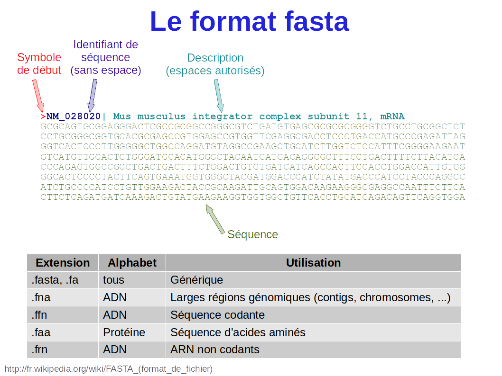
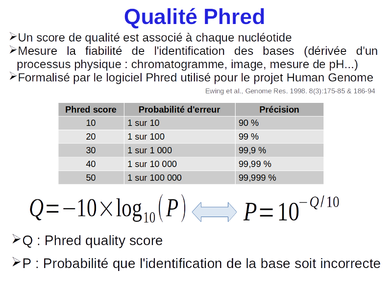
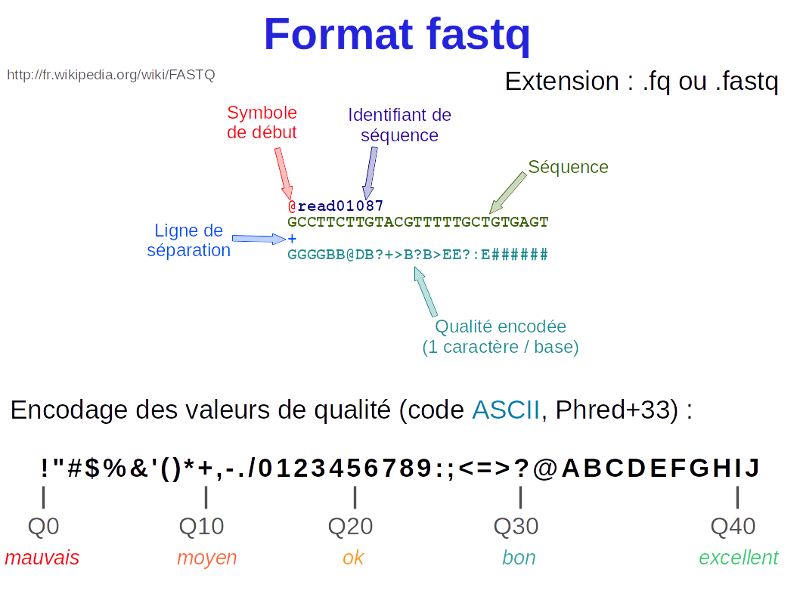

<!-- convert to md using 
      rmarkdown::render("05_RNAseq_analysis_GSE112441.Rmd", 
                        rmarkdown::md_document(variant = "markdown_github"), 
                        output_file="05_RNAseq_analysis_GSE112441.md") -->

<a rel="license" href="http://creativecommons.org/licenses/by/4.0/"></a><br />This work is licensed under a <a rel="license" href="http://creativecommons.org/licenses/by/4.0/">Creative Commons Attribution 4.0 International License</a>.

```{r setup, include=FALSE}
knitr::opts_chunk$set(echo = TRUE)
library(kableExtra)
```

## Données et mise en place  

_Dans ce document, les commandes de chargement des modules d'environnement correspondent au cluster de l'IFBcore (`core.cluster.france-bioinformatique.fr`).  
Si vous utilisez une autre plateforme de bioinformatique, il faudra adapter ces commandes, voire installer vous même les logiciels nécessaires aux analyses.  
Si vous êtes amenés à installer des logiciels, je vous suggère vivement d'utiliser [conda](https://conda.io/en/latest/index.html) et le canal [bioconda](https://bioconda.github.io/) dédié à la bioinformatique_  
</br>

### Présentation des données

Les données que nous analyserons sont disponibles sur **Gene Expression Omnibus** ([GEO](https://www.ncbi.nlm.nih.gov/geo/)) sous l'identifiant [GSE112441](https://www.ncbi.nlm.nih.gov/geo/query/acc.cgi?acc=GSE112441) et sont issues de [@pmid31554790].  
Dans ce travail, nous avons généré des plantes d'*Arabidopsis thaliana* mutantes pour 3 gènes appelés **BORDER** et nous avons comparé le transcriptome de ces plantes à des plantes de type sauvage (même génome mais non mutées) par [RNA-seq](https://en.wikipedia.org/wiki/RNA-Seq). Les deux extrémités des fragments d'ADNc ont été séquencés. On parle de séquençage *paired-end*.    
Dans deux publications, nous avons analysés les ARN dont l'abondance est **diminuée** chez les plantes mutantes par rapport aux plantes contrôles [@pmid31554790] et les ARN dont l'abondance est **augmentée** dans les plantes mutantes [@pmid34666004].  
L'étude porte également sur d'autres génotypes (*fpa*, *bdr1*, *bdr2* et *bdr3*) mais nous n'analyserons que les données correspondant aux triples mutants (*bdrs* = *bdr1,2,3*) et aux plantes contrôles non mutées (*WT*).  

[GEO](https://www.ncbi.nlm.nih.gov/geo/) est une base de données publique dédiée aux données de génomique. Elle est étroitement connectée avec la **Short Read Archive** ([SRA](https://www.ncbi.nlm.nih.gov/sra)), une base de données spécifiquement dédiée aux données de séquençage à haut-débit.  
Certaines données apparaissent donc à la fois dans **GEO** et dans **SRA** mais il arrive aussi que des données ne soient disponibles que dans l'une de ces deux sources.  
L'**European Nucleotide Archive** ([ENA](https://www.ebi.ac.uk/ena)) stocke une copie de la plupart des données présentes dans [SRA](https://www.ncbi.nlm.nih.gov/sra).  Depuis la France, c'est un site de choix pour télécharger des données.  


### Préparation des dossiers pour les analyses

#### Dossiers utilisés:
On commence par préparer les dossiers dans lesquels les analyses seront effectuée.  
Notre dossier partagé pour la formation est :

```bash
formdir="/shared/projects/form_2022_07"
```

Le dossier où nous analyserons les données:

```bash
workdir="${formdir}/TD_RNAseq"
```

Création des différents dossiers que nous utiliserons pour les analyses :  

```bash
# données :
datadir="${workdir}/data"
mkdir -p $datadir

# génome :
bankdir="${workdir}/bank"
mkdir -p $bankdir

# scripts :
scriptdir="${workdir}/scripts"
mkdir -p $scriptdir

# log :
logdir="${workdir}/log"
mkdir -p $logdir
```


#### Mise en place de votre session:

Si vous souhaitez reproduire les analyses de ce document, vous pouvez créer un dossier personnel contenant des liens vers les dossiers `datadir` et `bankdir` :

```bash
workdir="${formdir}/${USER}"
mkdir -p "${workdir}"
mkdir -p "${workdir}/log"
mkdir -p "${workdir}/scripts"
ln -s $datadir "${workdir}/data"
ln -s $bankdir "${workdir}/bank"
```

Puis vous mettez à jour les variables correspondant aux différents dossiers:

```bash
datadir="${workdir}/data"
bankdir="${workdir}/bank"
scriptdir="${workdir}/scripts"
logdir="${workdir}/log"
```


### Téléchargement des données

> Les données ont déjà été téléchargées. Vous n'avez donc pas à lancer les commandes présentées dans ce paragraphe.

Il y a plusieurs manières de récupérer les liens permettant de télécharger les données brutes d'une étude. Ici, on peut par exemple rechercher l'identifiant **SRA** de l'étude ([SRP136640](https://trace.ncbi.nlm.nih.gov/Traces/sra/?study=SRP136640)) dans l'outil [sra-explorer](https://sra-explorer.info/) qui génèrera un script permattant de télécharger les données brutes depuis l'[ENA](https://www.ebi.ac.uk/ena).  

Le RNA-seq étant *paired-end*, on récupère 2 fichiers de données brutes pour chaque échantillon.  

```bash
#création du dossier si il n'existe pas
mkdir -p $datadir

#déplacement dans le dossier:
cd $datadir

#téléchargement des fichiers (en leur assignant des noms plus explicites)
enaFolder="ftp://ftp.sra.ebi.ac.uk/vol1/fastq/SRR690"
curl -L $enaFolder/004/SRR6908884/SRR6908884_1.fastq.gz -o GSE112441_WT_rep1_R1.fastq.gz
curl -L $enaFolder/004/SRR6908884/SRR6908884_2.fastq.gz -o GSE112441_WT_rep1_R2.fastq.gz
curl -L $enaFolder/006/SRR6908886/SRR6908886_1.fastq.gz -o GSE112441_WT_rep3_R1.fastq.gz
curl -L $enaFolder/006/SRR6908886/SRR6908886_2.fastq.gz -o GSE112441_WT_rep3_R2.fastq.gz
curl -L $enaFolder/006/SRR6908896/SRR6908896_1.fastq.gz -o GSE112441_bdrs_rep1_R1.fastq.gz
curl -L $enaFolder/006/SRR6908896/SRR6908896_2.fastq.gz -o GSE112441_bdrs_rep1_R2.fastq.gz
curl -L $enaFolder/008/SRR6908898/SRR6908898_1.fastq.gz -o GSE112441_bdrs_rep3_R1.fastq.gz
curl -L $enaFolder/008/SRR6908898/SRR6908898_2.fastq.gz -o GSE112441_bdrs_rep3_R2.fastq.gz
curl -L $enaFolder/007/SRR6908897/SRR6908897_1.fastq.gz -o GSE112441_bdrs_rep2_R1.fastq.gz
curl -L $enaFolder/007/SRR6908897/SRR6908897_2.fastq.gz -o GSE112441_bdrs_rep2_R2.fastq.gz
curl -L $enaFolder/005/SRR6908885/SRR6908885_1.fastq.gz -o GSE112441_WT_rep2_R1.fastq.gz
curl -L $enaFolder/005/SRR6908885/SRR6908885_2.fastq.gz -o GSE112441_WT_rep2_R2.fastq.gz

```

Les fichiers téléchargés sont des fichiers compressés (*.gz*) de données brutes au format [fastq](https://fr.wikipedia.org/wiki/FASTQ) (extension *.fastq* ou bien *.fq*).  
Le nom [fastq](https://fr.wikipedia.org/wiki/FASTQ) provient de [**FASTA**](https://fr.wikipedia.org/wiki/FASTA_(format_de_fichier)) + **QUAL**.  
Un fichier [FASTA](https://fr.wikipedia.org/wiki/FASTA_(format_de_fichier)) contient des séquences:



Un fichier **QUAL** contient les [Score de qualité Phred](https://fr.wikipedia.org/wiki/Score_de_qualit%C3%A9_phred) de chaque nucléotide codés à l'aide du code [ASCII](https://fr.wikipedia.org/wiki/American_Standard_Code_for_Information_Interchange).



Donc, un fichier **fastq** regroupe ces deux informations: la **séquence** et la **qualité** de chaque nucléotide de la séquence.  Chaque **séquence** ou *read* est codé sur 4 lignes:



Ces fichiers sont décompressés à l'aide de la commande :

```bash
gunzip $datadir/*.fastq.gz
```

*Il n'est pas toujours obligatoire de décompresser les fichiers de données brutes. De nombreux outils acceptent directement les fichiers compressés*


## Génome, annotations et indexage

### Assemblages et annotations

**Le dossier "bank"**   
Pour analyser ces données, nous avons besoin:

  1. de la séquence du génome (fichier **fasta**)  
  2. des annotations, c'est à dire de la localisation sur le génome des éléments connus tels que les gènes, exons, éléments transposables, etc.  
  Les **annotations** sont disponibles dans des fichiers [**gff**](https://fr.wikipedia.org/wiki/General_feature_format) ou [**gtf**](https://mblab.wustl.edu/GTF22.html) où chaque élément est représenté sur une ligne contenant ses coordonnées sur le génome (chromosome, brin, start et end) ainsi que ses liens de parentés avec les autres éléments du génome. Par exemple, un gène peut être le parent de plusieurs transcrits qui peuvent être les parents de plusieurs exons/introns.  

Par ailleurs, nous allons **indexer** le génome afin de faciliter l'étape ultérieure d'alignement des reads sur le génome.  

**Bases de données**  
Il existe souvent plusieurs sources possibles pour télécharger les fichiers **fasta** et **gff** correspondant à un génome.  
La base de données [Ensembl](https://www.ensembl.org/) aggrège ces données pour de nombreuses espèces et est considérée comme particulièrement fiable dans le respect des format de fichier, ce qui n'est malheureusement pas toujours le cas et fait parfois échouer certains outils de bioinformatique.  
Il existe des sites dédiés d'Ensembl pour les [plantes](https://plants.ensembl.org/index.html) et les [champignons](https://fungi.ensembl.org/).  
On peut télécharger les données d'Ensembl via son [interface web](https://www.ensembl.org/) ou bien via son [site ftp](http://ftp.ensembl.org/pub).  
Pour l'homme et la souris, la base de données [GenCode](https://www.gencodegenes.org/) est également une source très utilisée.  
Enfin, pour chaque organisme ou famille d'organismes, il existe en général des sites dédiés qui aggrègent les données produites par la communauté scientifique travaillant sur cet organisme ou famille. C'est par exemple le cas pour [Arabidopsis](https://arabidopsis.org/) ou bien pour les [Solanacées](https://solgenomics.net/).  

**Version des données**  
Il faut bien saisir la différence entre :

  - un **assemblage** qui correspond à la séquence du génome, assemblée en **contigs** qui, idéalement, représente les **chromosomes**  
  - une **annotation** qui correspond aux coordonnées des **éléments connus** ("*features*") du génome sous la forme :  
      - **contig** (ou **chromosome**)  
      - **brin** (*strand* en anglais) = **+** ou **-**
      - **start**    
      - **end**  

Il est impératif de veiller à ce que l'**assemblage** du génome et les **annotations** se correspondent bien, c'est à dire que les coordonnées dans les annotations correspondent bien à la séquence.  
L'idéal est de télécharger les données d'une même source mais une petite vérification peut s'avérer utile : par exemple que quelques séquences codantes prises au hasard sur plusieurs chromosomes commencent bien toutes par `ATG`.   
En général, les annotations évoluent plus rapidement que les assemblages, même si cette tendance peut changer compte tenu des progrès en matière de séquençage. Il n'est donc pas rare d'avoir plusieurs versions des annotations correspondant à une même version 
Ici on récupèrera les données pour Arabidopsis directement depuis **The Arabidopsis Information Resource** ([TAIR](https://www.arabidopsis.org/)) et on travaillera sur la version **TAIR10**.  

### Séquence fasta / assemblage

Téléchargement de la séquence **fasta** de chaque chromosome

```bash
cd $bankdir
wget ftp://ftp.arabidopsis.org/home/tair/Sequences/whole_chromosomes/TAIR10_chr1.fas
wget ftp://ftp.arabidopsis.org/home/tair/Sequences/whole_chromosomes/TAIR10_chr2.fas
wget ftp://ftp.arabidopsis.org/home/tair/Sequences/whole_chromosomes/TAIR10_chr3.fas
wget ftp://ftp.arabidopsis.org/home/tair/Sequences/whole_chromosomes/TAIR10_chr4.fas
wget ftp://ftp.arabidopsis.org/home/tair/Sequences/whole_chromosomes/TAIR10_chr5.fas
wget ftp://ftp.arabidopsis.org/home/tair/Sequences/whole_chromosomes/TAIR10_chrC.fas
wget ftp://ftp.arabidopsis.org/home/tair/Sequences/whole_chromosomes/TAIR10_chrM.fas
```

Assemblage des séquences dans un fichier unique:
```
touch ${bankdir}/TAIR10.fa
for chr in 1 2 3 4 5 C M; do
  echo ">Chr${chr}" >> ${bankdir}/TAIR10.fa
  tail -n +2 ${bankdir}/TAIR10_chr${chr}.fas >> ${bankdir}/TAIR10.fa
  rm TAIR10_chr${chr}.fas
done
```

Préparation d'un index samtools
```bash
module load samtools/1.14
samtools faidx TAIR10.fa
```

L'index créé donne juste la taille de chaque chromosome:
```bash
cat TAIR10.fa.fai
```

### Annotations

Téléchargement des annotations:

```bash
cd $bankdir
wget ftp://ftp.arabidopsis.org/home/tair/Genes/TAIR10_genome_release/TAIR10_gff3/TAIR10_GFF3_genes.gff
```

Observation du fichier d'annotation:

```bash
head TAIR10_GFF3_genes.gff
```

### Index pour STAR

Aligner les reads sur le génome peut être vu comme la recherche (approchée) d'un mot (le *read*) dans un livre (le *génome*), en autorisant des mismatch et des insertions/déletions (indels). S'il s'agit d'un read de RNA-seq on autorisera aussi de larges "délétions" correspondant aux introns.  
Les outils d'alignement de reads courts (*short reads*) rendent cette recherche plus efficace en *indexant* le génome, un peu comme on peut indexer un livre en relevant tous les endroits où se trouve un mot.  
Nous utiliserons le logiciel [STAR](https://github.com/alexdobin/STAR) [@pmid23104886] pour aligner les reads de RNA-seq et donc pour créer un index du génome dans un premier temps.  
Lors de cette opération, [STAR](https://github.com/alexdobin/STAR) répertorie également les jonctions exon-intron connues à partir du fichier d'annotation **gff**.  

La commande pour créer l'index est la suivante:

```bash
module load star/2.7.9a

genomedir="${bankdir}/star_index"
mkdir -p $genomedir

STAR \
  --runMode genomeGenerate \
  --genomeDir ${genomedir} \
  --genomeFastaFiles ${bankdir}/TAIR10.fa \
  --sjdbGTFfile ${bankdir}/TAIR10_GFF3_genes.gff \
  --sjdbGTFtagExonParentTranscript Parent \
  --genomeSAindexNbases 12 \
;
```
L'argument `sjdbGTFtagExonParentTranscript` précise le tag utilisé pour établir le lien de parenté entre un exon et le ou les transcrit(s) auquel il appartient. La valeur par défaut de cet argument est `transcript_id` ce qui correspond au format GFF version 2 ou GTF or ici on utilise ici des annotations au format GFF3. On suit ici les recommandations de la [documentation](https://raw.githubusercontent.com/alexdobin/STAR/master/doc/STARmanual.pdf) de STAR. 
L'argument `genomeSAindexNbases` permet d'ajuster la longueur des *"mots"* utilisés dans l'index. On utilise ici la valeur recommandée par la [documentation](https://raw.githubusercontent.com/alexdobin/STAR/master/doc/STARmanual.pdf) de STAR.

Le script `scripts/01_a_STARindex.sh` permet de lancer cette commande sur le cluster.

```bash
sbatch ${scriptdir}/01_a_STARindex.sh
```

## QC sur les données brutes: [fastqc](https://www.bioinformatics.babraham.ac.uk/projects/fastqc/) et [multiqc](https://multiqc.info/docs/)  

Le logiciel [fastqc](https://www.bioinformatics.babraham.ac.uk/projects/fastqc/) fournit des contrôles qualités utiles pour évaluer la qualité des reads obtenus.  
[Multiqc](https://multiqc.info/docs/) permet d'agréger les résultats de fastQC (et de nombreux autres logiciels) pour tous les échantillons analyser et de les présenter sous la forme d'un rapport.  

Le script `scripts/02_a_fastQC.sh` permet de lancer [fastqc](https://www.bioinformatics.babraham.ac.uk/projects/fastqc/) sur le cluster:

```bash
sbatch ${scriptdir}/02_a_fastQC.sh
```

La commande est du type:

```bash
fastqc \
  -o <output_directory> \
  <fastq_file1> \
  <fastq_file2>
```

Une fois que les jobs précédents sont terminés, on peut lancer `scripts/02_b_MultiQC.sh` qui utilise [Multiqc](https://multiqc.info/docs/) pour agréger les résultats:  

```bash
sbatch ${scriptdir}/02_b_MultiQC.sh
```

la commande pour multiqc est également très simple:

```bash
multiqc \
  -n <nom_du_fichier_rapport> \
  -o <output_directory> \
  <dossier_à_analyser>
```

où le `<dossier_à_analyser>` est celui contenant les résultats de la commande `fastqc`


## References  
